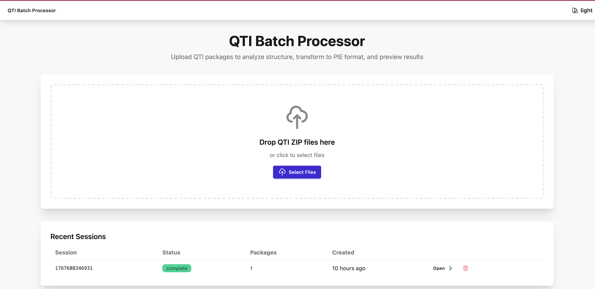

# PIE-QTI


This project provides two major capabilities:

1. **QTI 2.x & 3.0 Players** — Production-ready item and assessment players with unified version-agnostic architecture
2. **PIE ↔ QTI Transformation Framework** — Bidirectional transforms between QTI and PIE, with CLI, web app, and IMS Content Package support

📚 **[Live Examples](https://qti.pie-framework.org/examples/)**


> **Project Status**: QTI 2.x players are production-ready. Transform framework is under active development. See [STATUS.md](STATUS.md) for details.

---

> [!WARNING]
> While I believe the QTI player is production ready, we're still sticking to 0.1.x for a while, and we may make API changes between versions. I don't foresee a lot of that, but nevertheless, until this project has been used in the wild for a while, we may need some tweaks here and there to make the API good and meanwhile it's best to keep the code clean and unbothered with shims and other backwards compatibility constructs. Once we're at 1.0.0, we'll make stronger commitments for the API. But, let us know if you plan to use this for a non-trivial/ production system, and we can move such commitments forward.

---

## Why This Project Exists

[PIE](https://pie-framework.org/) (Portable Interactions and Elements) is a complete framework for playing and authoring assessment items, maintained by [Renaissance Learning](https://www.renaissance.com/) with implementation partner [MCRO](https://mcro.tech/).

Many Renaissance partners exchange content in **QTI format**, so bidirectional QTI ↔ PIE transformation is essential. This project **open sources that transformation framework** for partners and the broader community.

We also built a **spec-complete QTI 2.x player** because a modern, open-source option was missing—and we needed one for previewing, analysis, and "convert then render" workflows.

---

## Part 1: QTI Players (2.x & 3.0)

> **Status**: Production-ready (QTI 2.x); QTI 3.0 infrastructure complete, player enhancements in progress

Full-featured players for rendering QTI 2.x and 3.0 assessment content in the browser.

### Version-Agnostic Architecture

The players use a unified architecture that supports both QTI 2.x and 3.0 through automatic version detection:

- **QTI 2.x** — camelCase elements (`choiceInteraction`, `itemBody`)
- **QTI 3.0** — kebab-case with `qti-` prefix (`qti-choice-interaction`, `qti-item-body`)
- **Common Internal Model** — Both versions convert to the same canonical representation
- **Zero Breaking Changes** — Existing QTI 2.x code continues to work unchanged

See [`@pie-qti/qti-common`](packages/qti-common/README.md) for the version abstraction layer.

### Item Player (`@pie-qti/item-player`)

Renders and scores individual QTI items:

- **21 interaction types** — All QTI 2.2 interactions supported
- **45 response processing operators** — Complete client-side scoring
- **Role-based rendering** — Candidate, scorer, author, tutor, proctor, testConstructor
- **Adaptive items** — Multi-attempt workflows with progressive feedback
- **Accessible** — Full keyboard navigation and screen reader support (follows WCAG 2.2 Level AA guidelines)
- **Iframe isolation mode** — Optional secure rendering for untrusted content

### Assessment Player (`@pie-qti/assessment-player`)

Orchestrates multi-item assessments:

- **Navigation modes** — Linear (sequential) and nonlinear (free navigation)
- **Sections & hierarchy** — Nested sections with rubric blocks
- **Selection & ordering** — Random item selection and shuffling per QTI spec
- **Time limits** — Countdown timers with warnings and auto-submission
- **Item session control** — Max attempts, review/skip, response validation
- **State persistence** — Auto-save with resume capability
- **Outcome processing** — Scoring templates (total, weighted, percentage, pass/fail)
- **Backend adapter** — Optional server-side scoring and secure data handling

### Extensibility (Docs)

The player architecture separates QTI logic from UI rendering:

- **Plugin system** (`QTIPlugin`) — Register custom extractors, components, and lifecycle hooks
- **Registries** — Priority-based `ExtractionRegistry` and `ComponentRegistry`
- **Typesetting hook** — Host-provided math rendering (KaTeX adapter included)
- **Custom operators** — Support for `<customOperator>` elements

See the [ACME Likert plugin](packages/acme-likert-plugin/) for a complete extensibility example.

### Theming

Components render via web components (Shadow DOM) with a CSS variable contract:

- **Theme tokens** — DaisyUI-compatible variables (`--p`, `--a`, `--b1`, `--bc`, etc.)
- **`::part()` hooks** — Stable part names for host-side style refinement
- **Zero-CSS fallback** — Components render correctly with no host styles

See [STYLING.md](packages/default-components/STYLING.md) for the full styling contract.

### Internationalization (i18n)

The player UI supports multiple languages with runtime locale switching:

- **Type-safe translations** — TypeScript autocomplete for all message keys
- **Runtime switching** — Change language without page reload
- **Custom translations** — Clients provide complete locale bundles or override specific strings
- **Small bundle** — <10 KB gzipped (core + default locale)

See [`@pie-qti/i18n`](packages/i18n/) for the complete i18n API and [custom translation examples](packages/i18n/docs/custom-translations-example.md).

---

## Part 2: PIE ↔ QTI Transformation Framework

> **Status**: Under active development

Bidirectional transformation between QTI 2.2 XML and PIE JSON.

### Architecture Overview

The transformation framework provides a plugin-based architecture for converting between assessment formats:


The engine orchestrates transformations through:

- **Plugin Registry** — Priority-based plugin selection (vendor plugins override defaults)
- **Transform Engine** — Format detection, plugin matching, and execution
- **Extensibility System** — Custom transformers, asset resolvers, and vendor-specific handlers

See [Transformation Engine Documentation](docs/TRANSFORMATION-ENGINE.md) for complete architecture details.

### Transform Capabilities

**QTI → PIE** (`@pie-qti/to-pie`)

- Supports QTI 2.x and 3.0 (auto-detected)
- Lossless round-trip when QTI originated from PIE
- Best-effort semantic transformation otherwise
- Vendor extension system for custom QTI variants

**PIE → QTI** (`@pie-qti/pie-to-qti`)

- Lossless reconstruction when PIE contains embedded QTI
- Generator registry for custom PIE model handling
- IMS Content Package generation (`imsmanifest.xml`)

### Transform App (`@pie-qti/app-transform`)



Interactive web UI for transformations:

- **Upload** — Single files or ZIP packages (including nested ZIPs)
- **Analyze** — Discover items, count interactions, report issues
- **Transform** — Batch convert with progress reporting
- **Preview** — Side-by-side QTI and PIE rendering

Storage is pluggable with filesystem (default), S3, or database backends via configuration.

#### Plugin & Extension Management

The transform-app includes a built-in admin interface for viewing and managing plugins:

- Navigate to `/admin/plugins` to see installed transform plugins
- View registered vendor extensions and their counts
- Explore available extension points (storage backends, formats, themes, locales)
- Configuration examples and documentation

**Extension Points:**

- **Transform Plugins** — Add support for custom formats or vendor-specific QTI variants
- **Vendor Extensions** — Customize transformation behavior (detectors, transformers, asset resolvers)
- **Storage Backends** — Choose filesystem, S3, database, or implement custom storage
- **UI Themes** — Customize appearance with DaisyUI themes
- **i18n Locales** — Add translations for additional languages

**Configuration:**
Create a `config.json` file (see `apps/transform/config.example.json` for structure) and reference it:

```bash
PIE_QTI_CONFIG=./config.json bun run dev:transform
```

Or register plugins directly in `apps/transform/src/hooks.server.ts`.

### CLI (`@pie-qti/transform-cli`)

Command-line tool for batch operations:

```bash
# Transform a single item
bun run pie-qti -- transform input.xml --format qti22:pie --output output.json

# Analyze QTI content
bun run pie-qti -- analyze ./content-package/

# See all commands
bun run pie-qti -- --help
```

---

## Development

```bash
# Install dependencies
bun install

# Build all packages
bun run build

# Run tests
bun run test

# Lint and typecheck
bun run lint
bun run typecheck

# E2E tests (Playwright)
bun run test:e2e
```

### Local PIE Players

To test with [pie-players](https://github.com/pie-framework/pie-players) locally, clone both repos side-by-side. The postinstall script auto-links them.

### GitHub Pages Preview

```bash
bun run build:pages
bun run preview:pages
# Open http://localhost:4173/pie-qti/
```

---

## Documentation

### Architecture & Project Layout

- **[Architecture Guide](docs/ARCHITECTURE.md)** — System design, package map, extensibility, theming, and security

### Players

- **[Item Player](packages/item-player/README.md)** — API, interactions, accessibility
- **[Assessment Player](packages/assessment-player/README.md)** — Navigation, scoring, backend integration
- **[QTI Common](packages/qti-common/README.md)** — Version abstraction layer (QTI 2.x & 3.0)
- **[Styling Contract](packages/default-components/STYLING.md)** — Theming with CSS variables and ::part
- **[Example App](apps/demo/README.md)** — Demo application with all interactions

### Transforms

- **[Transformation Engine](docs/TRANSFORMATION-ENGINE.md)** — Architecture, plugin system, and extensibility
- **[Transformation Guide](docs/PIE-QTI-TRANSFORMATION-GUIDE.md)** — Bidirectional transform overview
- **[Vendor Plugin Guide](docs/VENDOR-TRANSFORM-PLUGIN-GUIDE.md)** — Building custom vendor plugins
- **[Configuration Guide](docs/CONFIGURATION.md)** — Storage backends, plugins, and environment setup
- **[Migration Guide](docs/MIGRATION_GUIDE.md)** — Upgrading from legacy storage to new architecture
- **[Transform App](apps/transform/README.md)** — Web UI for transformations
- **[CLI](tools/cli/README.md)** — Command-line batch operations
- **[QTI → PIE](packages/to-pie/README.md)** — QTI to PIE transformer
- **[PIE → QTI](packages/pie-to-qti/README.md)** — PIE to QTI transformer
- **[IMS Content Packages](packages/pie-to-qti/docs/MANIFEST-GENERATION.md)** — Manifest generation

### Extensibility

- **[Custom Generators](packages/pie-to-qti/CUSTOM-GENERATORS.md)** — Adding PIE model support
- **[ACME Likert Plugin](packages/acme-likert-plugin/README.md)** — Player extensibility example

---

## License

ISC License — see [LICENSE](LICENSE)
