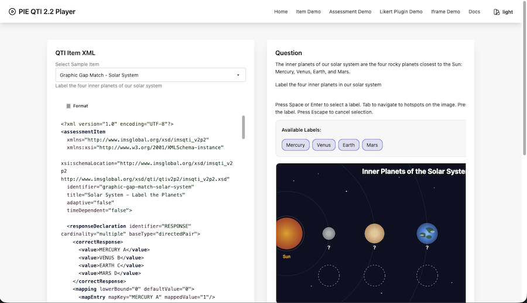

# PIE-QTI


This project provides two major capabilities:

1. **QTI 2.1, 2.2 & 3.0 Players** — Standards-oriented item and assessment players with a shared version-normalization architecture
2. **PIE ↔ QTI Transformation Framework** — Bidirectional transforms between QTI and PIE, with CLI, web app, and IMS Content Package support

📚 **[Live Examples](https://qti.pie-framework.org/examples/)**



> **Project Status**: The players have broad clean-room coverage but are not yet fully conformant or certified. Several delivery blockers are tracked in [SPEC-GAPS-PLAN.md](docs/SPEC-GAPS-PLAN.md). The transform framework is under active development. See [STATUS.md](STATUS.md) for details.

---

> [!WARNING]
> This project is pre-1.0: APIs may change, formal QTI certification is still in progress, and the current review found conformance and security blockers for arbitrary untrusted/high-stakes delivery. Evaluate the documented gaps for your content profile, use a backend-authoritative assessment integration, and contact the maintainers before adopting it for a non-trivial production system.

---

## Why This Project Exists

[PIE](https://pie-framework.org/) (Portable Interactions and Elements) is a complete framework for playing and authoring assessment items, maintained by [Renaissance Learning](https://www.renaissance.com/) with implementation partner [MCRO](https://mcro.tech/).

Many Renaissance partners exchange content in **QTI format**, so bidirectional QTI ↔ PIE transformation is essential. This project **open sources that transformation framework** for partners and the broader community.

We also built a **standards-oriented QTI player** because a modern, open-source option was missing—and we needed one for previewing, analysis, and "convert then render" workflows.

---

## Part 1: QTI Players

> **Status**: Pre-1.0 with broad item-delivery coverage. Do not interpret the registered interaction count or clean-room certification matrix as a claim that every schema-valid QTI item/test is playable. See [STATUS.md](STATUS.md) and the [spec-gap plan](docs/SPEC-GAPS-PLAN.md).

Full-featured players for rendering QTI assessment content in the browser.

### Version-Agnostic Architecture

The players use a unified architecture that supports both QTI 2.2 and 3.0 through automatic version detection:

- **QTI 2.2 syntax family** — camelCase elements (`choiceInteraction`, `itemBody`)
- **QTI 3.0** — kebab-case with `qti-` prefix (`qti-choice-interaction`, `qti-item-body`)
- **Common Internal Model** — Both versions convert to the same canonical representation
- **Zero Breaking Changes** — Existing QTI 2.2 code continues to work unchanged

See [`@pie-qti/qti-common`](packages/qti-common/README.md) for the version abstraction layer.

### Item Player (`@pie-qti/item-player`)

Renders and scores individual QTI items:

- **21 standard interaction extractors** — Broad shared extraction/rendering coverage; position-object, QTI 3 HTML vocabulary, PCI, record-cardinality, and extended-text cases remain open
- **Response processing AST/evaluator** — Broad operator coverage; canonical template aliases and external processing fragments still have known gaps
- **Role/view-aware rendering** — candidate, scorer, author, tutor, proctor, testConstructor
- **Adaptive items** — Multi-attempt workflows with progressive feedback
- **Accessible** — Full keyboard navigation and screen reader support (follows WCAG 2.2 Level AA guidelines)
- **Iframe isolation mode** — Optional secure rendering for untrusted content

### Assessment Player (`@pie-qti/assessment-player`)

Orchestrates multi-item assessments:

- **Navigation mode model** — Nonlinear delivery is available; irreversible back-navigation rules for linear test parts remain open
- **Sections & hierarchy runtime** — Nested internal models and rubric blocks are available, but raw XML ingestion is not yet lossless
- **Selection & ordering runtime** — Available for pre-resolved `SecureAssessment` models; raw `assessmentTest` XML ingestion does not yet preserve these rules
- **Time-limit runtime** — Countdown and auto-submission support exists, but independent item/section/part/test clocks and `minTime` enforcement remain open
- **Item session control** — Max attempts, review/skip, response validation
- **State persistence** — Auto-save with resume capability
- **Outcome processing** — Scoring templates (total, weighted, percentage, pass/fail)
- **Backend adapter** — Mandatory boundary for authoritative scoring in the core assessment player; the public assessment custom element currently uses the insecure reference adapter and is demo-only

### Extensibility (Docs)

The player architecture separates QTI logic from UI rendering:

- **Plugin system** (`QTIPlugin`) — Register custom extractors, components, and lifecycle hooks
- **Registries** — Priority-based `ExtractionRegistry` and `ComponentRegistry`
- **Typesetting hook** — Host-provided math rendering (KaTeX adapter included)
- **Custom operators** — Support for `<customOperator>` elements

See the [ACME Likert plugin](packages/acme-likert-plugin/) for a complete extensibility example.

### Theming

Components render via web components (Shadow DOM) with a CSS variable contract:

- **Theme tokens** — PIE-QTI CSS variables (`--pie-qti-*`) with DaisyUI bridge support
- **`::part()` hooks** — Stable part names for host-side style refinement
- **Zero-CSS fallback** — Components render correctly with no host styles

See [STYLING.md](packages/default-components/STYLING.md) for the full styling contract.

### Internationalization (i18n)

The player UI supports multiple languages with runtime locale switching:

- **Type-safe translations** — TypeScript autocomplete for all message keys
- **Runtime switching** — Change language without page reload
- **Custom translations** — Clients provide complete locale bundles or override specific strings
- **Small bundle** — <10 KB gzipped (core + default locale)

See [`@pie-qti/i18n`](packages/i18n/) for the complete i18n API and [custom translation examples](packages/i18n/docs/custom-translations-example.md).

---

## Part 2: PIE ↔ QTI Transformation Framework

> **Status**: Under active development

Bidirectional transformation between QTI XML and PIE JSON: QTI → PIE ingest, plus PIE → QTI 2.2 export.

### Architecture Overview

The transformation framework provides a plugin-based architecture for converting between assessment formats:


The engine orchestrates transformations through:

- **Plugin Registry** — Priority-based plugin selection (vendor plugins override defaults)
- **Transform Engine** — Format detection, plugin matching, and execution
- **Extensibility System** — Custom transformers, asset resolvers, and vendor-specific handlers

See [Transformation Engine Documentation](docs/TRANSFORMATION-ENGINE.md) for complete architecture details.

### Transform Capabilities

**QTI → PIE** (`@pie-qti/to-pie`)

- Supports QTI 2.2 and 3.0 (auto-detected)
- Lossless round-trip when QTI originated from PIE
- Best-effort semantic transformation otherwise
- Vendor extension system for custom QTI variants

**PIE → QTI** (`@pie-qti/pie-to-qti2`)

- Lossless reconstruction when PIE contains embedded QTI
- Generator registry for custom PIE model handling
- IMS Content Package generation (`imsmanifest.xml`)

### Extension Points

The transform pipeline is extensible at the package level. Production import workflows belong in host applications such as Composer CMS; this repository ships the reusable transform packages and examples:

- **Transform Plugins** — Add support for custom formats or vendor-specific QTI variants
- **Vendor Extensions** — Customize transformation behavior (detectors, transformers, asset resolvers)
- **Storage Backends** — Choose filesystem, S3, database, or implement custom storage

### CLI (`@pie-qti/transform-cli`)

Command-line tool for batch operations:

```bash
# Transform a single item
bun run pie-qti -- transform input.xml --format qti22:pie --output output.json

# Analyze QTI content
bun run pie-qti -- analyze-qti ./content-package/

# See all commands
bun run pie-qti -- --help
```

---

## Development

```bash
# Install dependencies
bun install

# Build all packages
bun run build

# Run tests
bun run test

# Lint and typecheck
bun run lint
bun run typecheck

# E2E tests (Playwright)
bun run test:e2e

# App deployability checks (docs/demo production builds)
bun run verify:apps:deploy

# Publish readiness (publint, attw, pack, deps, metadata)
bun run verify:publish
```

CI runs the main quality gates on PRs:

- **Lint/type gates:** Biome, Svelte checks, TypeScript, translation coverage, and unit tests
- **Certification gate:** `test:certification:public`
- **Accessibility gate:** `verify:a11y`
- **Deployability gate:** `verify:apps:deploy` (apps/docs and apps/demo production buildability)
- **Publishability gate:** `verify:publish:quick` (metadata, exports, publint, attw, pack, deps, source exports)

Release behavior is lockstep and patch-only for publishable `packages/*`:

- merges to `master` auto-generate a temporary patch changeset when needed for release PR prep
- local full release flow: `bun run release:with-version`

See [docs/development/publish-verification.md](docs/development/publish-verification.md) for full publish-readiness details.

### Local PIE Players

To test with [pie-players](https://github.com/pie-framework/pie-players) locally, clone both repos side-by-side. The postinstall script auto-links them.

### GitHub Pages Preview

```bash
bun run verify:apps:deploy
bun run docs:preview
# In another shell, preview the examples app if needed:
bun run preview:pages
```

---

## Documentation

### Architecture & Project Layout

- **[Architecture Guide](docs/ARCHITECTURE.md)** — System design, package map, extensibility, theming, and security
- **[PRD Inventory](docs/prds/INVENTORY.md)** — Canonical rationale and acceptance criteria map

### Players

- **[Item Player](packages/item-player/README.md)** — API, interactions, accessibility
- **[Assessment Player](packages/assessment-player/README.md)** — Navigation, scoring, backend integration
- **[QTI Common](packages/qti-common/README.md)** — Version abstraction layer (QTI 2.2 & 3.0)
- **[Styling Contract](packages/default-components/STYLING.md)** — Theming with CSS variables and ::part
- **[Example App](apps/demo/README.md)** — Demo application with all interactions

### Transforms

- **[Transformation Engine](docs/TRANSFORMATION-ENGINE.md)** — Architecture, plugin system, and extensibility
- **[Transformation Guide](docs/PIE-QTI-TRANSFORMATION-GUIDE.md)** — Bidirectional transform overview
- **[Vendor Plugin Guide](docs/VENDOR-TRANSFORM-PLUGIN-GUIDE.md)** — Building custom vendor plugins
- **[Source Profiles](docs/SOURCE-PROFILES.md)** — Real-world QTI source detection and import adaptation
- **[CLI](tools/cli/README.md)** — Command-line batch operations
- **[QTI → PIE](packages/to-pie/README.md)** — QTI to PIE transformer
- **[PIE → QTI](packages/pie-to-qti2/README.md)** — PIE to QTI transformer
- **[IMS Content Packages](packages/pie-to-qti2/docs/MANIFEST-GENERATION.md)** — Manifest generation

### Extensibility

- **[Custom Generators](packages/pie-to-qti2/CUSTOM-GENERATORS.md)** — Adding PIE model support
- **[ACME Likert Plugin](packages/acme-likert-plugin/README.md)** — Player extensibility example

---

## License

ISC License — see [LICENSE](LICENSE)
