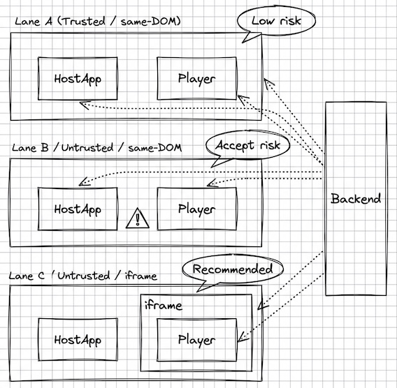
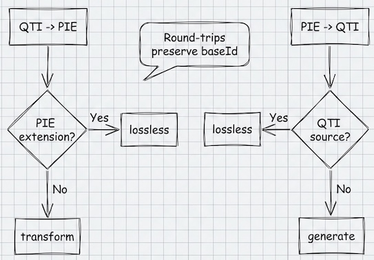
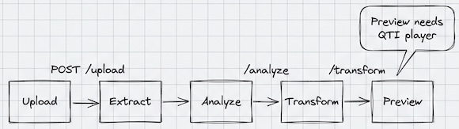

# Architecture: PIE-QTI

High-level architecture overview for PIE-QTI.

---

## What this repo provides (at a glance)

### Players

- **Item player**: render and score a single QTI item in the browser (plus extensibility and optional isolation).
- **Assessment player**: multi-item shell (navigation, sections, selection/ordering, state persistence, optional backend adapter).

### Transformations

- **QTI → PIE**: parse QTI 2.2 content and produce PIE JSON, with a lossless round-trip path when the source originated from PIE.
- **PIE → QTI**: generate QTI 2.2 XML from PIE JSON, including IMS Content Package support and a lossless round-trip path.

### Tools

- **CLI** for batch conversion and analysis.
- **Transform app** for upload → analyze → transform → preview.

### Version support (important boundary)

- **Transforms**: target **QTI 2.2** (`imsqti_v2p2`) for transformation. Treat other namespaces/variants as “ingest-time compatibility work” and validate early.
- **Players**: designed for **QTI 2.x** content in practice (role-based rendering, response processing, optional backend scoring patterns). For highest interoperability, keep content aligned to QTI 2.2.

---

## Repository map (mental model)

Everything lives under `packages/`:

### Transform system

- `packages/types`: shared transformation type contracts (input/output formats, storage interfaces)
- `packages/schemas`: PIE schema/validation assets
- `packages/core`: transform engine + plugin registry (format orchestration)
- `packages/storage`: pluggable storage backends (filesystem, S3, database)
- `packages/qti2-to-pie`: QTI → PIE transform plugin (plus vendor extension hooks)
- `packages/pie-to-qti2`: PIE → QTI transform plugin (generator registry + packaging)

### Player packages

- `packages/qti2-item-player`: QTI item player (core engine + extraction + web-component rendering + optional iframe host helper)
- `packages/qti2-assessment-player`: QTI assessment shell (sections, navigation, persistence, backend adapter)
- `packages/qti2-default-components`: default web components for QTI interactions (Svelte-authored, but web-component contract is framework-agnostic)

### Optional adapters / supporting packages

- `packages/qti2-i18n`: Internationalization (i18n) system for player UI (type-safe translations, runtime locale switching)
- `packages/qti2-typeset-katex`: KaTeX typesetting adapter (host-provided `typeset()` function)
- `packages/qti-processing`: response processing operators/templates used by the item player
- `packages/qti2-player-elements`, `packages/web-component-loaders`: web-component build/load helpers

### Apps

- `packages/transform-app`: web conversion UI
- `packages/qti2-example`: example app + fixtures + reference iframe runtime page

---

## QTI players: architecture & extensibility

> **Status**: Production-ready


### Item player (`packages/qti2-item-player`)

#### Core idea

The item player keeps “QTI logic” separate from “UI rendering”:

- **Core engine**: parse XML, track state, execute response processing, apply QTI roles.
- **Extraction**: produce `InteractionData` for each interaction (priority-based extractors).
- **Rendering**: render interactions via **web components** selected by a registry (priority + `canHandle()`).

This lets you:

- swap UI frameworks (web components are the contract),
- add vendor QTI support via plugins without forking the core,
- centralize typesetting and security policies.

#### Extensibility points (what you can plug in)

##### 1) `QTIPlugin` (primary extension mechanism)

Plugins can register:

- **Extractors**: interpret/validate vendor markup, override standard extraction.
- **Components**: map `InteractionData` → a custom element tag name (and optionally auto-register the element).
- **Lifecycle hooks**: integrate with host telemetry or setup logic.

Key references:

- `packages/qti2-item-player/src/core/Plugin.ts`
- `packages/qti2-item-player/src/core/PluginManager.ts`
- Example plugin: `packages/acme-likert-plugin/`


##### 2) Registries (explicit and composable)

- **ExtractionRegistry** (data extraction, priority-based)
- **ComponentRegistry** (renderer selection, priority-based)

Key reference:

- `packages/qti2-item-player/src/core/ComponentRegistry.ts`

##### 3) Typesetting hook (`typeset(rootEl)`)

The player intentionally does **not** bundle a math engine. Instead, the host can pass a `typeset` function, which is called after render (and can be re-invoked on DOM updates).

Default adapter:

- `packages/qti2-typeset-katex` provides `typesetMathInElement` and KaTeX CSS.

Key references:

- `packages/qti2-typeset-katex/README.md`
- `packages/qti2-item-player/src/components/actions/typesetAction.ts`
- `packages/qti2-item-player/src/core/ItemRenderer.ts` (applies `typeset` to the rendered wrapper)

##### 4) Custom operators (`customOperators`)

If you need QTI `<customOperator>` support, the player can be configured with a registry of operator implementations keyed by operator `class` (preferred) or `definition` URI.

Key reference:

- `packages/qti2-item-player/src/types/index.ts` (`customOperators`)

#### Optional isolation: iframe mode



For untrusted QTI, consider iframe isolation. The repo provides:

- **Host helper**: `@pie-qti/qti2-item-player/iframe`
- **Protocol types/validators** for postMessage messages

You host your own runtime page/app (the repo’s `qti2-example` includes a reference runtime for demo/testing).

Key references:

- `packages/qti2-item-player/docs/iframe-mode.md`
- `packages/qti2-item-player/src/iframe/IFramePlayerHost.ts`

#### Same-DOM safety controls (security configuration)

When rendering into the host DOM, configure security guardrails explicitly:

- **HTML sanitization** (what tags/attrs survive, and how URLs are filtered)
- **URL policy** (which protocols/hosts are allowed for extracted URLs and HTML attributes)
- **Parsing limits** (optional DoS guardrails)
- **Trusted Types policy name** (host-controlled; effective only if your CSP enforces Trusted Types)

Key references:

- `packages/qti2-item-player/src/types/index.ts` (`PlayerSecurityConfig`)
- `packages/qti2-item-player/src/core/sanitizer.ts`
- `packages/qti2-item-player/src/core/urlPolicy.ts`
- `packages/qti2-item-player/docs/security-audit.md`

---

### Assessment player (`packages/qti2-assessment-player`)

The assessment player orchestrates a multi-item test experience:

- navigation modes (linear/nonlinear)
- sections/hierarchy
- selection & ordering rules (randomization + seed)
- time limits and events
- item session control (attempts, review/skip/validation)
- state persistence (local-first, optional backend save)
- optional backend adapter for secure scoring and role-based filtering

Key references:

- `packages/qti2-assessment-player/README.md`
- `packages/qti2-assessment-player/BACKEND-INTEGRATION.md`

---

### Theming & styling (`packages/qti2-default-components`)

The default interaction components render via **web components** (Svelte custom elements) inside **Shadow DOM**. This provides encapsulation while remaining framework-agnostic for hosts.

#### Styling contract

The theming system balances three goals:

1. **Components work with zero host CSS** — Layout and accessibility styles are built-in.
2. **Host controls visual theming** — Colors, typography, and radii via CSS variables.
3. **Host can refine details** — Stable `::part()` hooks for targeted customization.

#### CSS variables (theme tokens)

Components consume DaisyUI-compatible variables:

| Variable | Purpose |
|----------|---------|
| `--p` | Primary color |
| `--a` | Accent color |
| `--b1`, `--b2`, `--b3` | Base surface colors |
| `--bc` | Base content (text) color |
| `--su` | Success color |

Usage in components: `hsl(var(--p))`, `hsl(var(--bc))`, etc.

If the host doesn't provide these variables, components fall back to safe defaults via `var(--token, fallback)`.

#### Host responsibilities

- Set theme variables on `:root` or any ancestor of the web component.
- Optionally set `data-theme="..."` for DaisyUI theme switching.

#### `::part()` hooks

Each component exposes stable part names for host-side CSS refinement:

```css
/* Example: customize order interaction items */
pie-qti-order::part(item) {
  border-radius: 12px;
}

pie-qti-order::part(handle) {
  opacity: 0.9;
}
```

Components expose parts for all major structural elements (lists, items, handles, prompts, inputs, etc.).

#### Baseline styles (Shadow DOM fallback)

The default components include a small baseline stylesheet (`ShadowBaseStyles`) that provides minimal styling for common DaisyUI classnames (`btn`, `alert`, `badge`, etc.) **inside Shadow DOM** when the host does not load DaisyUI/Tailwind.

Key references:

- `packages/qti2-default-components/STYLING.md` (full part catalog and examples)
- `packages/qti2-default-components/src/shared/components/ShadowBaseStyles.svelte`

---

## Internationalization (i18n)

> **Status**: Production-ready
> **Package**: `@pie-qti/qti2-i18n`

### Overview

The PIE-QTI player includes a lightweight, type-safe internationalization system for translating player UI strings (buttons, labels, error messages, ARIA text, etc.).

**Note**: This system translates the **player interface**, not QTI assessment content. Assessments are authored in the content creator's chosen language.

### Key features

- **Type-safe translations**: TypeScript autocomplete for all message keys
- **Runtime locale switching**: Change language without page reload or component remount
- **Reactive updates**: Svelte store integration automatically updates all UI text
- **Web Component compatible**: Works within Shadow DOM boundaries via context API
- **Small bundle size**: <10 KB gzipped (core + default English locale)
- **On-demand loading**: Additional locales loaded asynchronously when needed

### Supported locales (Priority 1)

| Locale Code | Language                    |
|-------------|-----------------------------|
| `en-US`     | English (United States)     |
| `es-ES`     | Spanish (Spain)             |
| `fr-FR`     | French (France)             |
| `de-DE`     | German (Germany)            |
| `pt-BR`     | Portuguese (Brazil)         |

### Architecture

The i18n system consists of:

1. **Core I18n class** (`I18n.ts`) - Message lookup, interpolation, pluralization, number/date formatting
2. **Svelte store integration** (`store.ts`) - Reactive `$t`, `$formatNumber`, `$formatDate` stores
3. **Context API** (`context.ts`) - Pass i18n instance through component tree (including Shadow DOM)
4. **Locale files** (`locales/*.ts`) - TypeScript modules with structured translation messages
5. **LocaleSwitcher component** - Dropdown UI for runtime locale selection

### Usage in components

```svelte
<script lang="ts">
  import { t } from '@pie-qti/qti2-i18n';
</script>

<!-- Simple translation -->
<button>{$t('common.submit')}</button>

<!-- With interpolation -->
<p>{$t('assessment.question', { current: 1, total: 10 })}</p>

<!-- Error messages -->
<div class="alert">{$t('interactions.upload.errorInvalidType', { types: 'pdf, jpg' })}</div>
```

### Initialization

Initialize i18n in the application root (e.g., `+layout.svelte`):

```typescript
import { initI18n } from '@pie-qti/qti2-i18n';

const i18n = initI18n('en-US');
await i18n.loadLocale('en-US');
```

### Message namespaces

Translations are organized by feature:

- `common.*` - Shared UI text (Submit, Cancel, Next, etc.)
- `units.*` - Unit formatting (bytes, KB, seconds, etc.)
- `validation.*` - Form validation messages
- `interactions.*` - QTI interaction-specific text (organized by interaction type)
- `assessment.*` - Assessment player UI (navigation, sections, timer, feedback)
- `accessibility.*` - ARIA labels and screen reader announcements

### Type safety

Message keys are automatically typed from the English locale structure. IDEs provide autocomplete and compile-time validation:

```typescript
$t('common.submit')  // ✅ Valid
$t('invalid.key')    // ❌ TypeScript error
```

### Key references

- `packages/qti2-i18n/README.md` - Full API documentation and migration guide
- `docs/i18n-design-plan.md` - Detailed design document with architecture rationale
- `packages/qti2-i18n/src/locales/en-US.ts` - Complete list of available translation keys

---

## Transformations: QTI ↔ PIE

> **Status**: Under active development

### Transform engine (`packages/core`)

`TransformEngine` is the orchestrator:

- detects source format if not provided,
- selects a plugin by `(sourceFormat, targetFormat)`,
- executes `plugin.transform()` and optionally `plugin.validate()`.

Key references:

- `packages/core/src/engine/transform-engine.ts`
- `packages/core/src/registry/plugin-registry.ts`

---

### QTI → PIE (`packages/qti2-to-pie`)



#### Two paths: lossless vs best-effort

1) **Lossless path**: if the QTI contains a PIE extension, the transformer extracts the embedded PIE model verbatim (perfect PIE reconstruction).
2) **Best-effort path**: otherwise, it detects interaction/test type and transforms QTI semantics into the closest PIE model(s).

#### Vendor extensibility

QTI → PIE supports a vendor extension system:

- detectors: identify vendor QTI patterns
- transformers: replace/override transformation logic
- asset resolvers / CSS class extractors / metadata extractors: preserve vendor details and keep round-trips stable

Key references:

- `packages/qti2-to-pie/src/plugin.ts` (vendor registration + lossless extraction checks)

---

### PIE → QTI (`packages/pie-to-qti2`)

#### Two paths: lossless vs generated

1) **Lossless path**: if the PIE item contains embedded QTI source, reconstruction returns that source verbatim.
2) **Generated path**: otherwise, a generator is selected from a registry to produce QTI XML (primary model today, with multi-model context).

#### Extensibility: custom generators

You can register custom generators to handle new/variant PIE models.

Key references:

- `packages/pie-to-qti2/src/plugin.ts` (`registerGenerator`, registry usage)
- `packages/pie-to-qti2/CUSTOM-GENERATORS.md`

#### IMS Content Package support

When configured (and typically when external passages are generated), the PIE → QTI plugin can also emit:

- `imsmanifest.xml` (IMS CP v1.1)
- item XMLs, passage XMLs, and assessment XMLs (as applicable)

Key reference:

- `packages/pie-to-qti2/docs/MANIFEST-GENERATION.md`

#### Identifier stability (`baseId`)

For stable references across systems:

- PIE `baseId` is preserved into QTI metadata
- the reverse transform restores `baseId` so repeated round-trips remain stable

Key reference:

- `packages/qti2-to-pie/src/plugin.ts` (`extractBaseId`)
- `packages/pie-to-qti2/src/plugin.ts` (`addSearchMetadata` stores `sourceSystemId` and `externalId`)

---

## Transform app (`packages/transform-app`): conversion + preview pipeline

> **Status**: Under active development



The transform app is a SvelteKit web UI that wires together:

- upload and extraction (pluggable storage backend with session management),
- analysis (discover items/tests, count interactions, record issues),
- transformation (batch convert to PIE),
- preview (QTI player preview and PIE player preview side-by-side).

### Storage architecture

The transform app uses a **pluggable storage system** (`@pie-qti/storage`) that abstracts storage backends:

- **Default**: Filesystem backend (stores sessions in `./uploads/sessions/`)
- **Optional**: S3, database, or custom backends via configuration

Sessions are stored with separate metadata files:

- `metadata.json` - Core session state (id, status, timestamps)
- `analysis.json` - Analysis results (packages, items, interactions)
- `transformation.json` - Transform results (items, assessments, errors)

This separation enables:

- Independent loading of analysis/transformation data
- Efficient storage backends (only fetch what's needed)
- Clear data ownership and versioning

Key references:

- Storage types: `packages/types/src/storage/index.ts`
- Storage package: `packages/storage/src/`
- App storage wrapper: `packages/transform-app/src/lib/server/storage/app-session-storage.ts`
- Configuration: `docs/CONFIGURATION.md`

### Server-side flow (sessioned)

1) **Upload**: `POST /api/upload` stores ZIP(s) in a new session
   - reference: `packages/transform-app/src/routes/api/upload/+server.ts`
2) **Analyze**: `POST /api/sessions/[id]/analyze` extracts and analyzes the session
   - reference: `packages/transform-app/src/routes/api/sessions/[id]/analyze/+server.ts`
3) **Transform**: `POST /api/sessions/[id]/transform` uses `TransformEngine` + `Qti22ToPiePlugin`
   - reference: `packages/transform-app/src/routes/api/sessions/[id]/transform/+server.ts`

### Preview model

- **QTI preview**: uses the QTI players + typesetting adapter to render XML directly.
- **PIE preview**: uses PIE web components (`pie-iife-player` / `pie-esm-player`) to render the transformed PIE config.

Key references:

- QTI item preview component: `packages/transform-app/src/lib/components/Qti2ItemPlayer.svelte`
- QTI assessment preview component: `packages/transform-app/src/lib/components/Qti2AssessmentPlayer.svelte`
- PIE preview component: `packages/transform-app/src/lib/components/PieItemPlayer.svelte`

---

## Deployment & trust boundaries (security guidance)

This section combines “deployment guidance” with “security boundary clarifications”. If you’re embedding this into a product, treat this as required reading.

### Trust boundaries (what this project does and does not do)

- **Same-DOM is not a sandbox**: rendering attacker-controlled content into your application DOM is inherently risky. The player provides **guardrails** (sanitization, URL policy, optional parsing limits, Trusted Types support), but it does **not** provide a complete isolation boundary.
- **Plugins/custom components are integrator-owned**: any `QTIPlugin` and any custom web components run as host code. Treat them as trusted application code (review, test, pin).
- **Client-side scoring is not secure**: for high-stakes assessment, you must do **server-side scoring** and avoid sending correct answers / scoring logic to the candidate.
- **Best isolation is origin isolation**: for untrusted QTI, prefer iframe mode and run the runtime on a separate origin with strict postMessage allowlists.

### Recommended deployment modes

#### Mode A: trusted content, same DOM (lowest complexity)

Use when you control authoring and inputs.

- Keep URL policy + sanitizer enabled anyway.
- Keep embeds disabled unless you explicitly allow them.
- Deploy with a baseline CSP.

#### Mode B: untrusted content, same DOM (risk acceptance)

If you must render third-party QTI in the host DOM:

- enforce strict URL policy and limit allowed protocols/hosts,
- enable parsing limits to reduce DoS surface,
- keep `<object>`/`<embed>`/`<iframe>` disabled,
- deploy strong CSP and consider Trusted Types enforcement.

Residual risk remains architectural.

#### Mode C: untrusted content with iframe isolation (recommended)

- host runtime on a **separate origin**,
- use sandboxing and strict origin allowlists,
- validate message types/versions, ignore unknown messages,
- keep runtime CSP separate from host CSP.

### Server-side scoring guidance (production)

For `candidate` role:

- do not ship `<correctResponse>` or `<responseProcessing>` to the browser,
- submit only candidate responses to the backend,
- score on the server using privileged role,
- return only the minimum outcomes needed for UX,
- persist sessions server-side if integrity matters.

Reference:

- `packages/qti2-assessment-player/BACKEND-INTEGRATION.md`

### CSP / Trusted Types guidance (production hardening)

At minimum:

- restrict `script-src`, `connect-src`, `img-src`, `media-src`, `font-src` to what you actually need,
- avoid `unsafe-inline` if possible,
- if you can: enforce Trusted Types and set the player’s `trustedTypesPolicyName` to match your CSP policy.

### Validation strategy (practical)

You’ll likely want multiple layers:

- schema/XSD validation where feasible (pre-ingestion),
- transform-time validation (plugin-level warnings),
- render-time checks (player errors/warnings),
- optional external validators (e.g. QTIWorks) as a secondary signal for interoperability.

---

## Further reading (key docs)

- Transformation overview: `docs/PIE-QTI-TRANSFORMATION-GUIDE.md`
- QTI 2.2 notes: `docs/QTI_2.2_techguide.md`
- IMS Content Package notes: `docs/IMS_Content_Packages_techguide.md`
- QTI item player: `packages/qti2-item-player/README.md`
- Iframe mode reference: `packages/qti2-item-player/docs/iframe-mode.md`
- Security audit notes: `packages/qti2-item-player/docs/security-audit.md`
- QTI assessment player: `packages/qti2-assessment-player/README.md`
- Backend integration: `packages/qti2-assessment-player/BACKEND-INTEGRATION.md`
- IMS Content Packages: `packages/pie-to-qti2/docs/MANIFEST-GENERATION.md`
