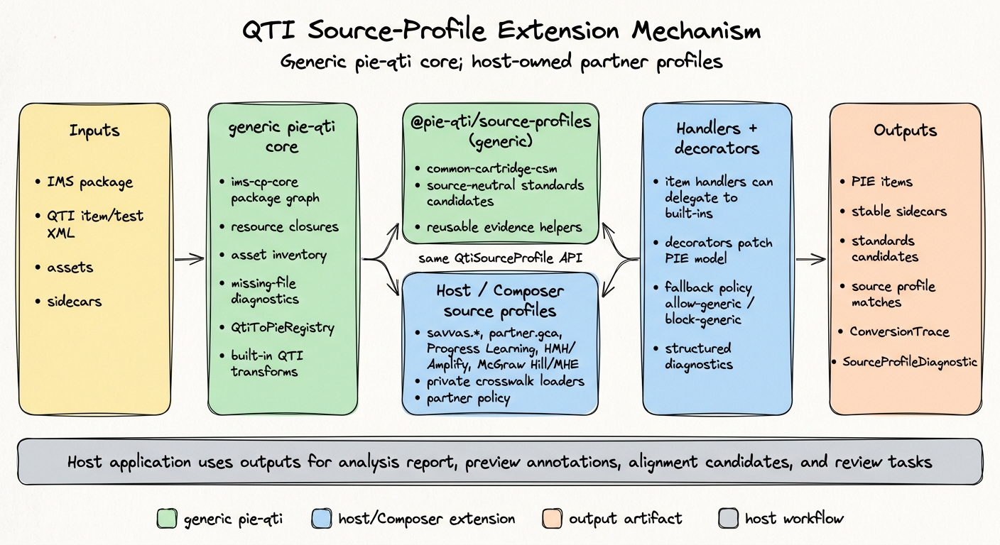

# QTI Source Profiles

Source profiles are the preferred extension model for real-world QTI imports that are mostly standards-shaped but carry source-specific package conventions, metadata, proprietary interactions, sidecars, or repair needs.

They replace broad vendor branches with scored, traceable feature detection. A package can match more than one profile, for example generic Common Cartridge CSM standards plus a host-owned profile for proprietary interaction handling.

## Architecture Overview



The diagram shows the end-to-end extension surface introduced by PIE-569:

- **Inputs and analysis** (top row): the IMS package is parsed by `@pie-qti/ims-cp-core` into a resource graph (closures, `assessmentItemRef` resolution, asset inventory, missing-file diagnostics), then offered to source profiles for `detectPackage` / `detectItem`.
- **Pipeline** (middle row, inside `@pie-qti/to-pie`): `QtiToPieRegistry` holds the built-in handlers; **source profile item handlers** can transform proprietary content, return `null`, or call `delegate.continue()` to reuse a built-in handler; **item decorators** patch the generic PIE model at `afterModel` / `beforeFinalize` / `afterFinalize`; **fallback / diagnostics** enforce `allow-generic` vs `block-generic` policy with structured `SourceProfileDiagnostic`s.
- **Trace bar**: every decision is recorded as `ConversionTrace` events for host-side review.
- **Source profiles**: generic, source-neutral profiles can ship from `@pie-qti/source-profiles`; partner/publisher-specific profiles should register from host packages using the same `QtiSourceProfile` API.
- **Outputs** (right): PIE items, stable sidecars, source-profile matches, standard candidates, and structured diagnostics + trace, all consumable by host UIs.

Host policy (CDN URLs, private standards crosswalks, storage destinations) deliberately stays outside `pie-qti`.

## Design Principles

- Keep generic QTI transforms as the default path. Source profiles should decorate, delegate to, or block generic handling only where the source evidence requires it.
- Put reusable, source-neutral handling in `@pie-qti/source-profiles`; keep partner/publisher profiles, S3 paths, private standards crosswalks, item-bank writes, and allowlists outside `pie-qti`.
- Prefer diagnostics over lossy conversion. If matched content is proprietary or ambiguous, emit a structured diagnostic or use `fallbackPolicy: 'block-generic'` instead of silently reducing the item.
- Make every custom decision visible through `ConversionTrace`, `SourceProfileMatch`, sidecars, warnings, and source diagnostics.
- Use product-neutral language in code. Model the technical concept as a source profile even when a business workflow later distinguishes partners from publishers.

## Runtime Shape

`@pie-qti/to-pie` accepts `sourceProfiles` on item and package transforms:

```ts
import { transformQtiPackageToPie } from '@pie-qti/to-pie';
import { defaultSourceProfiles } from '@pie-qti/source-profiles';

const result = await transformQtiPackageToPie({
  manifestXml,
  fileAccess,
  sourceProfiles: [...defaultSourceProfiles],
});

console.log(result.sourceProfiles);
console.log(result.sourceDiagnostics);
console.log(result.sidecars);
console.log(result.conversionTrace.events);
```

Package transforms aggregate item outputs into a host-facing result. Package-level matches and trace events live at the top level; item-level matches and item handler/decorator/fallback trace events remain on each `itemOutputs[n].metadata.conversionTrace`.

- `sourceProfiles`: package profile matches with confidence and evidence.
- `sourceDiagnostics`: structured profile diagnostics suitable for review UI.
- `standardCandidates`: raw standards evidence from package and item extraction; host applications decide crosswalk policy.
- `sidecars`: stable IDs for source QTI, assets, stylesheets, catalogs, rubrics, passages, and profile-owned artifacts.
- `conversionTrace`: package-level events showing package analysis, package profile matching, sidecar emission, package diagnostics, and package extraction.

## Authoring A Profile

Create one module per source profile. Use `packages/source-profiles/src/` for generic, source-neutral profiles only; use a host package for partner/publisher profiles. Keep detection and extraction small and evidence-driven.

```ts
import type { QtiSourceProfile } from '@pie-qti/transform-types';

export const examplePublisherProfile: QtiSourceProfile = {
  id: 'publisher.example',
  label: 'Example Publisher QTI',
  vendor: 'example-publisher',
  capabilities: ['detect', 'interactions', 'metadata'],
  detectPackage(context) {
    if (!context.manifestXml?.includes('ExamplePublisher')) return null;
    return {
      profileId: 'publisher.example',
      scope: 'package',
      confidence: 0.9,
      evidence: [
        {
          type: 'source-identity',
          scope: 'package',
          message: 'Manifest contains ExamplePublisher identity metadata.',
        },
      ],
    };
  },
};
```

Add a generic profile to `packages/source-profiles/src/index.ts` only when false positives are controlled with negative tests and the behaviour is not tied to a private partner/publisher contract. Host-owned profiles should export from the host package instead:

```ts
import { examplePublisherProfile } from '@example/qti-source-profiles';
```

Shared extraction should stay shared. For example, do not re-extract Common Cartridge CSM standards in a host-owned publisher or partner profile if `common-cartridge-csm` already emits those candidates; source-specific profiles should add only source-specific candidates, metadata, sidecars, diagnostics, or handlers.

## Handlers, Decorators, And Fallback

Use item handlers for whole-item cases. A handler can return a complete `TransformOutput`, return `null` to allow the next handler or policy-controlled fallback, or call the delegate to reuse built-in behavior when the matched content is still standard QTI.

```ts
itemHandlers: [
  {
    id: 'publisher.example.custom-widget',
    fallbackPolicy: 'block-generic',
    canHandle(context) {
      return /custom-widget/i.test(context.xml ?? '');
    },
    async transform() {
      // Until this widget has a faithful mapping, block generic conversion
      // instead of silently reducing proprietary content.
      return null;
    },
  },
];
```

Use item decorators when the source profile only needs to adjust the generic PIE item. Decorators run at explicit phases and are traced.

```ts
decorators: [
  {
    id: 'publisher.example.metadata',
    phase: 'afterModel',
    async apply(context, item) {
      (item as { metadata?: Record<string, unknown> }).metadata = {
        sourcePath: context.sourcePath,
      };
    },
  },
];
```

Set fallback policy deliberately:

- `allow-generic`: generic conversion may proceed if a matching handler returns no output, but the runtime emits diagnostics.
- `block-generic`: matched content must be explicitly handled. This is safer for proprietary interactions or known malformed publisher content.

## Sidecars And Assets

Package transformation emits stable sidecar IDs for package artifacts. Profiles may add their own sidecars through package or item extraction, but should keep them host-neutral:

- `id` must be deterministic and stable for the source artifact.
- `sourcePath` and `sourceResourceId` should point back to the package resource when known.
- `referencedBy` should identify affected resources or items.
- `metadata` should include compact evidence, not large raw XML or binary payloads.

Preview URLs, CDN rewrites, storage destinations, and publish fan-out are host concerns and should not be encoded in source profiles.

## Built-In And Host-Owned Profiles

- Built into `@pie-qti/source-profiles`: `common-cartridge-csm`, which extracts CSM standard candidates from manifest metadata.
- Host-owned packages can register partner/publisher profiles such as Savvas, GCA/UGA, Progress Learning, HMH/Amplify, or McGraw Hill/MHE using the same `QtiSourceProfile` API.

Host-owned profiles should be intentionally incremental. Add source-specific conversion behavior only when fixtures and fidelity expectations are clear; otherwise prefer precise diagnostics and reviewable trace output.
