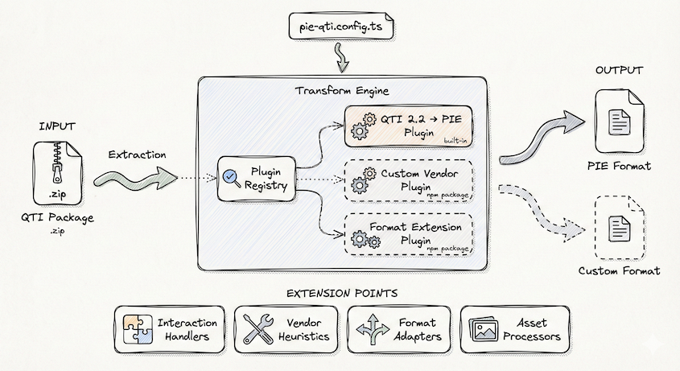
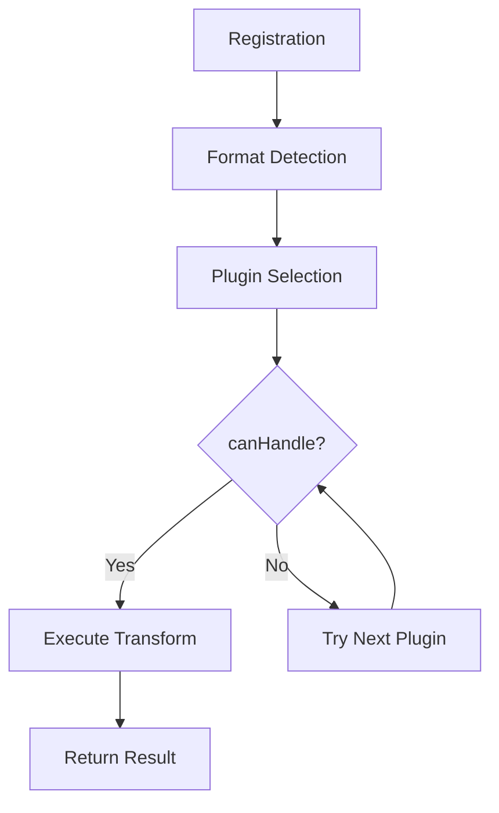

# QTI Transformation Engine

Comprehensive guide to the PIE-QTI transformation framework architecture, plugin system, and extensibility model.

## Table of Contents

1. [Overview](#overview)
2. [Architecture](#architecture)
3. [Plugin System](#plugin-system)
4. [Transform Engine](#transform-engine)
5. [Extensibility Points](#extensibility-points)
6. [Building Custom Plugins](#building-custom-plugins)
7. [Transform App Integration](#transform-app-integration)
8. [CLI Integration](#cli-integration)
9. [Best Practices](#best-practices)

---

## Overview

The PIE-QTI transformation framework provides a flexible, plugin-based architecture for bidirectional content transformation between assessment formats (primarily QTI 2.2 ↔ PIE).

### Key Features

- **Plugin-Based Architecture** — Extensible through custom plugins
- **Priority-Based Selection** — Vendor plugins override default transformers
- **Format Agnostic** — Support for multiple source and target formats
- **Asset Resolution** — Handle vendor-specific asset URLs and CDN integration
- **Vendor Extensions** — Custom transformers for proprietary QTI extensions
- **Storage Abstraction** — Pluggable storage backends (filesystem, S3, database)

### Architecture Diagram



The diagram illustrates:

- **Transform Engine** — Core orchestration layer
- **Plugin Registry** — Priority-based plugin management
- **Transform Plugins** — Format-specific transformers (QTI→PIE, PIE→QTI)
- **Vendor Extensions** — Custom plugins for vendor-specific content
- **Storage Backends** — Abstraction for file storage (local, S3, etc.)

---

## Architecture

### Core Components

```
┌─────────────────────────────────────────────────────────────┐
│                     Transform Engine                         │
│  Orchestrates transformations, manages plugins, handles     │
│  format detection, and routes content to appropriate plugins │
├─────────────────────────────────────────────────────────────┤
│  ┌──────────────────────────────────────────────────────┐  │
│  │             Plugin Registry                          │  │
│  │  - Registers transform plugins                       │  │
│  │  - Manages plugin priorities                         │  │
│  │  - Selects appropriate plugin for format pair        │  │
│  └──────────────────────────────────────────────────────┘  │
│                          │                                   │
│                          ▼                                   │
│  ┌──────────────────────────────────────────────────────┐  │
│  │          Transform Plugins                           │  │
│  │                                                       │  │
│  │  QTI 2.2 → PIE Plugin (priority: 100)                │  │
│  │  PIE → QTI 2.2 Plugin (priority: 100)                │  │
│  │  Vendor Plugin A (priority: 500)                     │  │
│  │  Vendor Plugin B (priority: 600)                     │  │
│  └──────────────────────────────────────────────────────┘  │
│                          │                                   │
│                          ▼                                   │
│  ┌──────────────────────────────────────────────────────┐  │
│  │          Extensibility Layer                         │  │
│  │                                                       │  │
│  │  - Custom transformers                               │  │
│  │  - Asset resolvers                                   │  │
│  │  - Vendor-specific handlers                          │  │
│  │  - Response processing extensions                    │  │
│  └──────────────────────────────────────────────────────┘  │
│                          │                                   │
│                          ▼                                   │
│  ┌──────────────────────────────────────────────────────┐  │
│  │          Storage Abstraction                         │  │
│  │                                                       │  │
│  │  - Filesystem backend                                │  │
│  │  - S3 backend                                        │  │
│  │  - Database backend                                  │  │
│  └──────────────────────────────────────────────────────┘  │
└─────────────────────────────────────────────────────────────┘
```

### Component Responsibilities

#### Transform Engine

**Package:** `@pie-qti/transform-core`

**Responsibilities:**
- Accept transform requests with source content and target format
- Detect or validate source format
- Find appropriate plugin via registry
- Execute transformation
- Return standardized results

**Key Methods:**
```typescript
class TransformEngine {
  use(plugin: TransformPlugin): void;
  transform(input: TransformInput, context?: TransformContext): Promise<TransformOutput>;
}
```

#### Plugin Registry

**Package:** `@pie-qti/transform-core`

**Responsibilities:**
- Register plugins with metadata (id, version, formats, priority)
- Maintain priority-ordered plugin lists
- Select best plugin for format pair
- Handle plugin conflicts and overrides

**Selection Algorithm:**
```typescript
// Plugins sorted by priority (descending)
// First plugin where canHandle() returns true wins
const candidates = plugins
  .filter(p => p.sourceFormat === source && p.targetFormat === target)
  .sort((a, b) => (b.priority ?? 100) - (a.priority ?? 100));

for (const plugin of candidates) {
  if (await plugin.canHandle(input)) {
    return plugin;
  }
}
```

#### Transform Plugins

**Packages:**
- `@pie-qti/to-pie` — QTI 2.2 → PIE
- `@pie-qti/pie-to-qti2` — PIE → QTI 2.2
- Vendor-specific plugins (custom)

**Interface:**
```typescript
interface TransformPlugin {
  readonly id: string;
  readonly version: string;
  readonly name: string;
  readonly sourceFormat: TransformFormat;
  readonly targetFormat: TransformFormat;
  readonly priority?: number;

  canHandle(input: TransformInput): Promise<boolean>;
  transform(input: TransformInput, context: TransformContext): Promise<TransformOutput>;
}
```

**Responsibilities:**
- Detect if content can be handled
- Perform format transformation
- Report errors and warnings
- Return transformed content with metadata

---

## Plugin System

### Plugin Lifecycle



### Plugin Priority

Plugins are selected based on priority when multiple plugins support the same format pair:

| Priority Range | Purpose | Example Use Case |
|----------------|---------|------------------|
| 1-99 | Low priority | Fallback implementations |
| 100-499 | Normal priority | Default framework plugins |
| 500-999 | High priority | **Vendor-specific overrides** |
| 1000+ | Critical priority | Framework internals |

**Example:**

```typescript
// Default QTI plugin (priority: 100)
export class Qti22ToPiePlugin implements TransformPlugin {
  readonly priority = 100;
  // Handles all standard QTI content
}

// Vendor plugin (priority: 500)
export class VendorAcmePlugin implements TransformPlugin {
  readonly priority = 500;
  // Handles ACME-specific QTI extensions

  async canHandle(input: TransformInput): Promise<boolean> {
    return input.content.includes('xmlns:acme=');
  }
}
```

When both plugins are registered:
1. Engine checks VendorAcmePlugin first (higher priority)
2. If `canHandle()` returns true, uses VendorAcmePlugin
3. Otherwise, falls back to Qti22ToPiePlugin

### Plugin Registration

#### CLI Registration

In `tools/cli/src/index.ts`:

```typescript
import { TransformEngine } from '@pie-qti/transform-core';
import { Qti22ToPiePlugin } from '@pie-qti/to-pie';
import { PieToQti2Plugin } from '@pie-qti/pie-to-qti2';
import { vendorAcmePlugin } from '@vendor/acme-plugin';

const engine = new TransformEngine();

// Register default plugins
engine.use(new Qti22ToPiePlugin());
engine.use(new PieToQti2Plugin());

// Register vendor plugins (higher priority)
engine.use(vendorAcmePlugin);
```

#### Web App Registration

In `apps/transform/src/lib/transform/engine.ts`:

```typescript
import { TransformEngine } from '@pie-qti/transform-core';
import { loadPlugins } from './plugin-loader';

export async function createEngine(): Promise<TransformEngine> {
  const engine = new TransformEngine();

  // Load core plugins
  const corePlugins = await loadPlugins('core');
  corePlugins.forEach(p => engine.use(p));

  // Load vendor plugins from configuration
  const vendorPlugins = await loadPlugins('vendor');
  vendorPlugins.forEach(p => engine.use(p));

  return engine;
}
```

---

## Transform Engine

### Transform Process Flow

```
1. Input Validation
   ↓
2. Format Detection (if not specified)
   ↓
3. Plugin Selection (via registry)
   ↓
4. Plugin Execution
   ↓
5. Result Aggregation
   ↓
6. Output Formatting
```

### Input Structure

```typescript
interface TransformInput {
  content: string | object;           // QTI XML string or PIE object
  format?: TransformFormat;           // Optional format hint
  metadata?: Record<string, unknown>; // Additional metadata
}

interface TransformContext {
  logger?: Logger;
  storage?: StorageBackend;
  config?: Record<string, unknown>;
  credentials?: Record<string, string>;
}
```

### Output Structure

```typescript
interface TransformOutput {
  items: TransformOutputItem[];      // Transformed items
  format: TransformFormat;            // Output format
  metadata: TransformMetadata;        // Transform metadata
  warnings?: TransformWarning[];      // Non-fatal issues
  errors?: TransformError[];          // Fatal errors
  passageFiles?: PassageFile[];       // External passages (PIE→QTI)
  manifest?: string;                  // IMS manifest (PIE→QTI)
}

interface TransformOutputItem {
  content: any;                       // Transformed content
  format: TransformFormat;            // Item format
}
```

### Error Handling

Errors are categorized for appropriate handling:

```typescript
enum ErrorCategory {
  VALIDATION = 'validation',          // Invalid input (malformed QTI)
  CONFIGURATION = 'configuration',    // Setup errors (missing config)
  INTERNAL = 'internal',              // Plugin bugs
  EXTERNAL = 'external',              // Service failures (S3 down)
}

interface TransformError {
  itemId?: string;
  message: string;
  code?: string;
  category: ErrorCategory;
  recoverable: boolean;               // Can retry?
  fatal: boolean;                     // Stop entire transform?
  cause?: Error;
  context?: Record<string, unknown>;
}
```

**Usage Example:**

```typescript
try {
  const result = await engine.transform(input);

  if (result.errors && result.errors.length > 0) {
    const fatal = result.errors.filter(e => e.fatal);
    if (fatal.length > 0) {
      throw new Error(`Fatal errors: ${fatal.map(e => e.message).join(', ')}`);
    }

    // Log non-fatal errors
    result.errors.forEach(e => console.warn(e.message));
  }

  return result;
} catch (error) {
  // Handle transform failure
}
```

---

## Extensibility Points

The transformation framework provides multiple extensibility points for custom behavior.

### 1. Custom Transform Plugins

Create plugins for new format pairs or vendor-specific content.

**Use Cases:**
- Support new assessment formats (e.g., Moodle XML)
- Handle vendor-specific QTI extensions
- Implement specialized transformations

**Example:**

```typescript
export class CustomFormatPlugin implements TransformPlugin {
  readonly id = 'custom-format-to-pie';
  readonly sourceFormat = 'custom' as TransformFormat;
  readonly targetFormat = 'pie' as TransformFormat;
  readonly priority = 500;

  async canHandle(input: TransformInput): Promise<boolean> {
    // Detect custom format
    return typeof input.content === 'string' &&
           input.content.startsWith('<?xml version="1.0"?>');
  }

  async transform(input: TransformInput, context: TransformContext): Promise<TransformOutput> {
    // Transform logic
  }
}
```

### 2. Custom Transformers

Extend transformation logic within a plugin for specific content types.

**Use Cases:**
- Handle custom interaction types
- Transform proprietary response processing
- Map vendor-specific elements

**Example:**

```typescript
export interface ContentTransformer<TInput, TOutput> {
  canTransform(input: TInput): boolean;
  transform(input: TInput): TOutput;
}

export class AcmeInteractionTransformer implements ContentTransformer<any, any> {
  canTransform(input: any): boolean {
    return input.type === 'customInteraction' &&
           input.attributes?.['data-vendor'] === 'acme';
  }

  transform(input: any): any {
    // Map ACME interaction to PIE element
    return {
      element: '@pie-element/drag-and-drop',
      mode: 'sequence',
      // ... transformed properties
    };
  }
}
```

### 3. Asset Resolvers

Resolve vendor-specific asset URLs to accessible locations.

**Use Cases:**
- Resolve CDN URLs
- Generate presigned S3 URLs
- Proxy protected assets

**Example:**

```typescript
export interface AssetResolver {
  canResolve(url: string): boolean;
  resolve(url: string, context?: AssetContext): Promise<string>;
}

export class AcmeCDNResolver implements AssetResolver {
  canResolve(url: string): boolean {
    return url.startsWith('acme://') || url.startsWith('acme-cdn://');
  }

  async resolve(url: string, context?: AssetContext): Promise<string> {
    const path = url.replace(/^acme(-cdn)?:\/\//, '');
    return `https://cdn.acme.com/assets/${path}`;
  }
}
```

### 4. Storage Backends

Implement custom storage for packages and transformed content.

**Use Cases:**
- Enterprise storage systems
- Cloud storage providers
- Database storage

**Example:**

```typescript
export interface StorageBackend {
  read(path: string): Promise<Buffer>;
  write(path: string, data: Buffer): Promise<void>;
  exists(path: string): Promise<boolean>;
  list(path: string): Promise<string[]>;
}

export class DatabaseStorageBackend implements StorageBackend {
  async read(path: string): Promise<Buffer> {
    const record = await db.files.findOne({ path });
    return Buffer.from(record.content);
  }
  // ... other methods
}
```

---

## Building Custom Plugins

See the comprehensive [Vendor Plugin Guide](VENDOR-TRANSFORM-PLUGIN-GUIDE.md) for detailed instructions.

### Quick Start

1. **Create Plugin Package**

```bash
mkdir -p packages/vendor-custom-plugin
cd packages/vendor-custom-plugin
npm init -y
```

2. **Implement Plugin Interface**

```typescript
import type { TransformPlugin } from '@pie-qti/transform-types';

export class VendorCustomPlugin implements TransformPlugin {
  readonly id = 'vendor-custom-qti22-to-pie';
  readonly sourceFormat = 'qti22' as const;
  readonly targetFormat = 'pie' as const;
  readonly priority = 500;

  async canHandle(input: TransformInput): Promise<boolean> {
    // Vendor detection logic
  }

  async transform(input: TransformInput, context: TransformContext): Promise<TransformOutput> {
    // Transformation logic
  }
}
```

3. **Register Plugin**

```typescript
import { createEngine } from '@pie-qti/transform-core';
import { VendorCustomPlugin } from './vendor-custom-plugin';

const engine = createEngine();
engine.use(new VendorCustomPlugin());
```

### Testing Plugins

```typescript
import { describe, test, expect } from 'bun:test';
import { TransformEngine } from '@pie-qti/transform-core';
import { VendorCustomPlugin } from '../src';

describe('VendorCustomPlugin', () => {
  test('should handle vendor-specific content', async () => {
    const engine = new TransformEngine();
    engine.use(new VendorCustomPlugin());

    const result = await engine.transform({
      content: qtiXml,
    });

    expect(result.errors).toHaveLength(0);
    expect(result.items).toHaveLength(1);
  });
});
```

---

## Transform App Integration

The web application ([transform-app](../apps/transform/)) provides a UI for the transformation engine.

### App Architecture

```
Transform Web App
├── Upload Interface
│   ├── File upload (ZIP, XML, JSON)
│   ├── Package extraction
│   └── Content validation
├── Analysis Module
│   ├── Package structure inspection
│   ├── Item discovery
│   └── Issue detection
├── Transform Module
│   ├── Engine initialization
│   ├── Plugin registration
│   ├── Batch transformation
│   └── Progress reporting
├── Preview Module
│   ├── QTI Player integration
│   ├── PIE Player integration
│   └── Side-by-side comparison
└── Export Module
    ├── Download results
    ├── Package generation
    └── Manifest creation
```

### Plugin Integration

The app loads plugins dynamically based on configuration:

```typescript
// apps/transform/src/lib/transform/plugin-loader.ts
export async function loadPlugins(category: 'core' | 'vendor'): Promise<TransformPlugin[]> {
  const config = await loadConfig();
  const plugins: TransformPlugin[] = [];

  if (category === 'core') {
    // Load core plugins
    plugins.push(new Qti22ToPiePlugin());
    plugins.push(new PieToQti2Plugin());
  } else {
    // Load vendor plugins from configuration
    for (const vendorConfig of config.vendorPlugins || []) {
      const plugin = await importVendorPlugin(vendorConfig);
      plugins.push(plugin);
    }
  }

  return plugins;
}
```

### Storage Integration

The app uses configurable storage backends:

```typescript
// apps/transform/src/lib/storage/index.ts
export function createStorageBackend(config: StorageConfig): StorageBackend {
  switch (config.type) {
    case 'filesystem':
      return new FilesystemBackend(config.path);
    case 's3':
      return new S3Backend(config.bucket, config.credentials);
    case 'database':
      return new DatabaseBackend(config.connectionString);
    default:
      throw new Error(`Unknown storage type: ${config.type}`);
  }
}
```

---

## CLI Integration

The command-line interface ([tools/cli](../tools/cli/)) provides batch transformation capabilities.

### CLI Architecture

```bash
pie-qti transform input.xml --format qti22:pie --output output.json
```

The CLI:
1. Parses command-line arguments
2. Initializes transform engine with plugins
3. Loads input content
4. Executes transformation
5. Writes output files
6. Reports results

### Plugin Loading

```typescript
// tools/cli/src/commands/transform.ts
export async function transformCommand(args: TransformArgs) {
  const engine = new TransformEngine();

  // Load core plugins
  engine.use(new Qti22ToPiePlugin());
  engine.use(new PieToQti2Plugin());

  // Load vendor plugins if configured
  const vendorPlugins = await loadVendorPlugins();
  vendorPlugins.forEach(p => engine.use(p));

  // Execute transformation
  const result = await engine.transform({
    content: await readFile(args.input),
  });

  // Write results
  await writeResults(result, args.output);
}
```

### Configuration File

```json
{
  "plugins": [
    {
      "name": "@vendor/acme-plugin",
      "priority": 500,
      "config": {
        "cdnBaseUrl": "https://cdn.acme.com",
        "apiKey": "${ACME_API_KEY}"
      }
    }
  ],
  "storage": {
    "type": "filesystem",
    "path": "./output"
  }
}
```

---

## Best Practices

### Plugin Development

1. **Use Appropriate Priority**
   - Default plugins: 100-499
   - Vendor overrides: 500-699
   - Special cases: 700-999

2. **Implement Robust Detection**
   ```typescript
   async canHandle(input: TransformInput): Promise<boolean> {
     // Check multiple signals
     // Be specific to avoid false positives
     // Return false on any doubt
   }
   ```

3. **Handle Errors Gracefully**
   ```typescript
   try {
     return await this.transform(input);
   } catch (error) {
     return {
       items: [],
       errors: [{
         category: ErrorCategory.INTERNAL,
         message: error.message,
         fatal: true,
       }],
     };
   }
   ```

4. **Preserve Metadata**
   ```typescript
   result.metadata = {
     sourceFormat: this.sourceFormat,
     targetFormat: this.targetFormat,
     pluginId: this.id,
     vendor: this.vendorId,
     timestamp: new Date(),
   };
   ```

5. **Test Round-Trips**
   ```typescript
   test('round-trip preservation', async () => {
     const original = createTestItem();
     const qti = await pieToQti.transform(original);
     const reconstructed = await qtiToPie.transform(qti);
     expect(reconstructed).toEqual(original);
   });
   ```

### Asset Resolution

1. **Use Resolver Chain**
   ```typescript
   private resolvers = [
     new CDNResolver(),
     new S3Resolver(),
     new LocalResolver(),
   ];

   async resolveAsset(url: string): Promise<string> {
     for (const resolver of this.resolvers) {
       if (resolver.canResolve(url)) {
         return await resolver.resolve(url);
       }
     }
     return url; // Fallback to original
   }
   ```

2. **Cache Resolved URLs**
   ```typescript
   private cache = new Map<string, string>();

   async resolveAsset(url: string): Promise<string> {
     if (this.cache.has(url)) {
       return this.cache.get(url)!;
     }
     const resolved = await this.doResolve(url);
     this.cache.set(url, resolved);
     return resolved;
   }
   ```

### Performance

1. **Batch Operations**
   ```typescript
   async transformBatch(inputs: TransformInput[]): Promise<TransformOutput[]> {
     return Promise.all(inputs.map(i => this.transform(i)));
   }
   ```

2. **Lazy Initialization**
   ```typescript
   private _parser?: Parser;

   get parser(): Parser {
     if (!this._parser) {
       this._parser = new Parser(this.config);
     }
     return this._parser;
   }
   ```

3. **Stream Large Files**
   ```typescript
   async transformStream(input: ReadStream): Promise<WriteStream> {
     // Use streaming for large QTI packages
   }
   ```

---

## Related Documentation

- **[PIE-QTI Transformation Guide](PIE-QTI-TRANSFORMATION-GUIDE.md)** — User guide for transformations
- **[Vendor Plugin Guide](VENDOR-TRANSFORM-PLUGIN-GUIDE.md)** — Building custom plugins
- **[Configuration Guide](CONFIGURATION.md)** — Storage and plugin configuration
- **[Architecture Guide](ARCHITECTURE.md)** — Overall system architecture

---

## Support

For questions or issues:

1. Review this documentation and related guides
2. Check examples in `packages/` and `examples/`
3. Open an issue on GitHub with:
   - Plugin code or configuration
   - Input content (QTI or PIE)
   - Error messages and stack traces
   - Expected vs. actual output

## License

ISC
