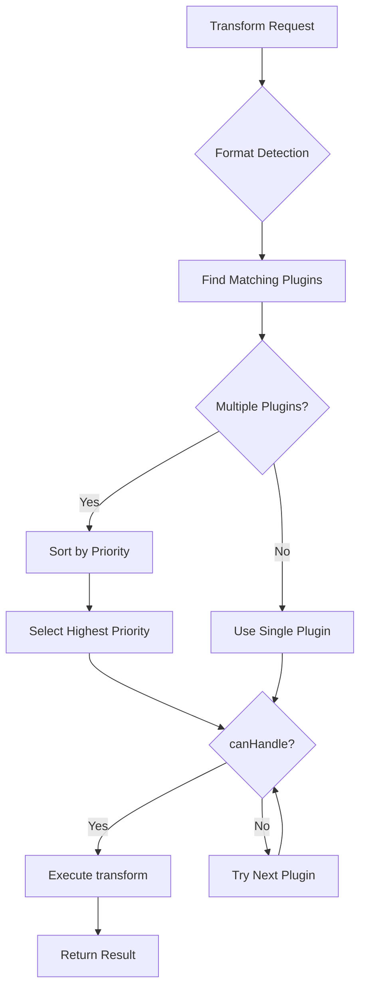

# Vendor Transform Plugin Developer Guide

This guide provides comprehensive instructions for building vendor-specific transform plugins for the PIE-QTI framework. Vendor plugins allow you to handle proprietary QTI extensions and transformations specific to your assessment vendor.

## Table of Contents

1. [Quick Start](#quick-start)
2. [Understanding the Architecture](#understanding-the-architecture)
3. [Plugin Interface Deep Dive](#plugin-interface-deep-dive)
4. [Vendor Detection Patterns](#vendor-detection-patterns)
5. [Custom Transformers](#custom-transformers)
6. [Asset Resolution](#asset-resolution)
7. [Plugin Priority System](#plugin-priority-system)
8. [Testing Strategy](#testing-strategy)
9. [Configuration](#configuration)
10. [Deployment](#deployment)
11. [Complete Example](#complete-example)

---

## Quick Start

### Prerequisites

- Node.js 20.19+ or Bun runtime
- Basic understanding of QTI 2.2 specification
- Familiarity with PIE model format

### Project Setup

```bash
# Create new package in your monorepo
mkdir -p packages/vendor-acme-plugin
cd packages/vendor-acme-plugin

# Initialize package.json
cat > package.json <<EOF
{
  "name": "@your-org/vendor-acme-plugin",
  "version": "1.0.0",
  "type": "module",
  "main": "./dist/index.js",
  "types": "./dist/index.d.ts",
  "dependencies": {
    "@pie-qti/transform-core": "workspace:*",
    "@pie-qti/transform-types": "workspace:*",
    "@pie-qti/to-pie": "workspace:*"
  },
  "devDependencies": {
    "@pie-qti/test-utils": "workspace:*",
    "typescript": "^5.9.3"
  },
  "scripts": {
    "build": "tsc",
    "test": "bun test tests"
  }
}
EOF
```

### Minimal Plugin Implementation

Create `src/index.ts`:

```typescript
import type { TransformPlugin, TransformInput, TransformOutput, TransformContext } from '@pie-qti/transform-types';
import { Qti22ToPiePlugin } from '@pie-qti/to-pie';

export class VendorAcmePlugin implements TransformPlugin {
  readonly id = 'vendor-acme-qti22-to-pie';
  readonly version = '1.0.0';
  readonly name = 'Vendor ACME QTI 2.2 to PIE Plugin';
  readonly sourceFormat = 'qti22' as const;
  readonly targetFormat = 'pie' as const;
  readonly priority = 500; // Override default plugin

  private defaultPlugin = new Qti22ToPiePlugin();

  /**
   * Check if this plugin can handle the input
   * Return true only for ACME vendor content
   */
  async canHandle(input: TransformInput): Promise<boolean> {
    if (typeof input.content !== 'string') return false;

    // Detect ACME vendor-specific markers
    return (
      input.content.includes('xmlns:acme="http://acme.com/qti/extensions"') ||
      input.content.includes('data-vendor="acme"')
    );
  }

  /**
   * Transform ACME QTI to PIE
   */
  async transform(input: TransformInput, context: TransformContext): Promise<TransformOutput> {
    // Delegate to default plugin, but could add ACME-specific handling
    return this.defaultPlugin.transform(input, context);
  }
}

// Export plugin instance
export const vendorAcmePlugin = new VendorAcmePlugin();
```

### Register Plugin

In your application or CLI:

```typescript
import { TransformEngine } from '@pie-qti/transform-core';
import { vendorAcmePlugin } from '@your-org/vendor-acme-plugin';

const engine = new TransformEngine();
engine.use(vendorAcmePlugin); // Registers with priority 500
```

That's it! Your vendor plugin will now handle ACME content with priority over the default plugin.

---

## Understanding the Architecture

### Plugin Lifecycle



### Plugin Priority System

Plugins are selected based on **priority** when multiple plugins support the same format pair:

| Priority Range | Purpose | Example Use Case |
|----------------|---------|------------------|
| 1-99 | Low priority | Fallback implementations |
| 100-499 | Normal priority | Default framework plugins |
| 500-999 | High priority | **Vendor-specific overrides** |
| 1000+ | Critical priority | Framework internals |

**Key Insight**: Vendor plugins should use priority **500-999** to override default plugins while allowing framework internals to take precedence.

### Component Interaction

```
┌─────────────────────────────────────────────────────────────┐
│                     Transform Engine                         │
├─────────────────────────────────────────────────────────────┤
│                                                               │
│  ┌──────────────────────────────────────────────────────┐  │
│  │             Plugin Registry                          │  │
│  │                                                       │  │
│  │  - Vendor Plugin (priority: 500)                     │  │
│  │  - Default Plugin (priority: 100)                    │  │
│  └──────────────────────────────────────────────────────┘  │
│                          │                                   │
│                          ▼                                   │
│  ┌──────────────────────────────────────────────────────┐  │
│  │          Selected Plugin (Vendor)                    │  │
│  │                                                       │  │
│  │  canHandle() ──> Vendor Detection                    │  │
│  │  transform() ──> Custom Transformers                 │  │
│  └──────────────────────────────────────────────────────┘  │
│                          │                                   │
│                          ▼                                   │
│  ┌──────────────────────────────────────────────────────┐  │
│  │           Transform Result                           │  │
│  └──────────────────────────────────────────────────────┘  │
└─────────────────────────────────────────────────────────────┘
```

---

## Plugin Interface Deep Dive

### TransformPlugin Interface

```typescript
interface TransformPlugin {
  // Identification
  readonly id: string;              // Unique plugin identifier
  readonly version: string;         // Semantic version
  readonly name: string;            // Human-readable name

  // Format support
  readonly sourceFormat: TransformFormat;  // 'qti22' | 'pie'
  readonly targetFormat: TransformFormat;  // 'pie' | 'qti22'

  // Priority system
  readonly priority?: number;       // Default: 100

  // Core methods
  canHandle(input: TransformInput): Promise<boolean>;
  transform(input: TransformInput, context: TransformContext): Promise<TransformOutput>;

  // Optional lifecycle methods
  initialize?(options: PluginOptions): Promise<void>;
  validate?(output: TransformOutput): Promise<ValidationResult>;
  dispose?(): Promise<void>;
}
```

### TransformOutput Structure

The plugin must return a `TransformOutput` object with the following structure:

```typescript
interface TransformOutput {
  // Transformed items (wrapped with format information)
  items: TransformOutputItem[];

  // Primary output format
  format: TransformFormat;

  // Transformation metadata
  metadata: TransformMetadata;

  // Optional warnings and errors
  warnings?: TransformWarning[];
  errors?: TransformError[];
}

interface TransformOutputItem {
  // Item content (PIE object for PIE format, XML string for QTI format)
  content: any;

  // Format of this specific item
  format: TransformFormat;
}
```

### Error Categorization

The framework provides an `ErrorCategory` enum for classifying errors:

```typescript
enum ErrorCategory {
  VALIDATION = 'validation',      // User input errors (invalid QTI, missing elements)
  CONFIGURATION = 'configuration', // Setup errors (missing API keys, invalid config)
  INTERNAL = 'internal',          // Plugin/framework bugs (null pointer, unexpected state)
  EXTERNAL = 'external',          // External service errors (S3 unavailable, API timeout)
}

interface TransformError {
  itemId?: string;               // Item identifier if error is item-specific
  message: string;               // Error message
  code?: string;                 // Error code for programmatic handling
  category: ErrorCategory;       // Error classification
  recoverable: boolean;          // Whether error can be retried
  fatal: boolean;                // Whether error stops entire transformation
  cause?: Error;                 // Underlying cause if error is wrapped
  context?: Record<string, unknown>; // Additional debugging context
}
```

**Usage Example:**

```typescript
return {
  items: [],
  format: this.targetFormat,
  metadata: { /* ... */ },
  errors: [{
    message: 'Failed to parse QTI XML',
    code: 'INVALID_XML',
    category: ErrorCategory.VALIDATION,
    recoverable: false,
    fatal: true,
    cause: error instanceof Error ? error : undefined,
  }],
};
```

### canHandle() Implementation Patterns

The `canHandle()` method is critical for vendor detection. Here are common patterns:

#### Pattern 1: XML Namespace Detection

```typescript
async canHandle(input: TransformInput): Promise<boolean> {
  if (typeof input.content !== 'string') return false;

  // Check for vendor namespace
  return input.content.includes('xmlns:acme="http://acme.com/qti/extensions"');
}
```

#### Pattern 2: Attribute Pattern Matching

```typescript
async canHandle(input: TransformInput): Promise<boolean> {
  if (typeof input.content !== 'string') return false;

  // Check for vendor-specific attributes
  const hasVendorAttr = input.content.includes('data-vendor="acme"');
  const hasVendorClass = input.content.includes('class="acme-item"');

  return hasVendorAttr || hasVendorClass;
}
```

#### Pattern 3: XML Structure Analysis

```typescript
import { parse } from 'node-html-parser';

async canHandle(input: TransformInput): Promise<boolean> {
  if (typeof input.content !== 'string') return false;

  try {
    const doc = parse(input.content);
    const root = doc.querySelector('assessmentItem');

    // Check for vendor-specific elements
    const hasVendorInteraction = doc.querySelector('customInteraction[data-vendor="acme"]');
    const hasVendorProcessing = root?.getAttribute('processingMode') === 'acme-adaptive';

    return !!(hasVendorInteraction || hasVendorProcessing);
  } catch {
    return false;
  }
}
```

#### Pattern 4: Content Analysis

```typescript
async canHandle(input: TransformInput): Promise<boolean> {
  if (typeof input.content !== 'string') return false;

  // Heuristic-based detection
  const vendorMarkers = [
    'acme:customInteraction',
    'data-acme-type',
    'acme-response-processing',
  ];

  return vendorMarkers.some(marker => input.content.includes(marker));
}
```

### transform() Implementation Patterns

#### Pattern 1: Delegate to Default with Pre-processing

```typescript
async transform(input: TransformInput, context: TransformContext): Promise<TransformOutput> {
  // Pre-process vendor-specific content
  const processed = this.preprocessAcmeContent(input.content as string);

  // Delegate to default plugin
  const result = await this.defaultPlugin.transform({
    ...input,
    content: processed,
  }, context);

  // Post-process if needed
  return this.postprocessResult(result);
}

private preprocessAcmeContent(xml: string): string {
  // Convert ACME-specific markup to standard QTI
  return xml
    .replace(/acme:customInteraction/g, 'customInteraction')
    .replace(/data-acme-type="([^"]*)"/g, 'data-pie-type="$1"');
}
```

#### Pattern 2: Custom Transformation

```typescript
async transform(input: TransformInput, context: TransformContext): Promise<TransformOutput> {
  const doc = parse(input.content as string);
  const items: TransformOutputItem[] = [];

  // Custom transformation logic
  for (const itemEl of doc.querySelectorAll('assessmentItem')) {
    const pieModel = this.transformAcmeItem(itemEl);
    items.push({
      content: pieModel,
      format: this.targetFormat,
    });
  }

  return {
    items,
    format: 'pie',
    metadata: {
      sourceFormat: 'qti22',
      targetFormat: 'pie',
      pluginId: this.id,
      timestamp: new Date(),
      itemCount: items.length,
      processingTime: 0,
    },
  };
}
```

#### Pattern 3: Selective Override

```typescript
async transform(input: TransformInput, context: TransformContext): Promise<TransformOutput> {
  // Use default for most content
  const result = await this.defaultPlugin.transform(input, context);

  // Override specific interactions
  for (const item of result.items) {
    const content = item.content;
    if (content.interactions) {
      content.interactions = content.interactions.map(interaction =>
        this.transformAcmeInteraction(interaction)
      );
    }
  }

  return result;
}
```

---

## Vendor Detection Patterns

### Strategy 1: Namespace-Based Detection

**Best for**: Vendors that properly extend QTI with custom namespaces

```typescript
export class VendorDetector {
  static NAMESPACE_PATTERNS = {
    pearson: 'xmlns:pearson="http://www.pearsoned.com/qti"',
    renaissance: 'xmlns:ren="http://renaissance.com/qti/ext"',
    cambium: 'xmlns:cam="http://cambium.com/qti/extensions"',
  };

  static detect(xml: string): string | null {
    for (const [vendor, pattern] of Object.entries(this.NAMESPACE_PATTERNS)) {
      if (xml.includes(pattern)) return vendor;
    }
    return null;
  }
}
```

### Strategy 2: Signature-Based Detection

**Best for**: Vendors with distinctive markup patterns

```typescript
export class SignatureDetector {
  static SIGNATURES = {
    acme: [
      'data-vendor="acme"',
      'class="acme-interaction"',
      '<acmeInteraction',
    ],
    vendor2: [
      'customInteraction[data-type="vendor2-drag-drop"]',
      'responseProcessing[template="vendor2://']',
    ],
  };

  static detect(xml: string): string | null {
    for (const [vendor, signatures] of Object.entries(this.SIGNATURES)) {
      const matches = signatures.filter(sig => xml.includes(sig)).length;
      if (matches >= 2) return vendor; // Require multiple matches
    }
    return null;
  }
}
```

### Strategy 3: Metadata-Based Detection

**Best for**: Content with embedded vendor metadata

```typescript
async canHandle(input: TransformInput): Promise<boolean> {
  // Check metadata first
  if (input.metadata?.vendor === 'acme') return true;

  // Fall back to content analysis
  const doc = parse(input.content as string);
  const metadata = doc.querySelector('qti-metadata-field[name="vendor"]');

  return metadata?.text === 'acme';
}
```

### Strategy 4: Configuration-Based Detection

**Best for**: When vendor information is external to content

```typescript
export interface VendorPluginConfig {
  vendorId: string;
  detectionRules: {
    patterns?: string[];
    attributes?: Record<string, string>;
    metadata?: Record<string, string>;
  };
}

async canHandle(input: TransformInput): Promise<boolean> {
  // Check explicit vendor specification
  if (input.metadata?.vendorId === this.config.vendorId) return true;

  // Apply configured detection rules
  return this.applyDetectionRules(input);
}
```

---

## Custom Transformers

### When to Create Custom Transformers

Create custom transformers when:

1. **Vendor-specific interactions** that don't map to standard QTI
2. **Custom response processing** beyond standard templates
3. **Proprietary scoring algorithms**
4. **Specialized content types** (e.g., simulations, virtual labs)

### Transformer Interface Pattern

```typescript
export interface VendorTransformer<TInput, TOutput> {
  /**
   * Check if transformer can handle this input
   */
  canTransform(input: TInput): boolean;

  /**
   * Transform input to output
   */
  transform(input: TInput): TOutput;
}
```

### Example: Custom Interaction Transformer

```typescript
export class AcmeInteractionTransformer implements VendorTransformer<any, any> {
  canTransform(input: any): boolean {
    return input.type === 'customInteraction' &&
           input.attributes?.['data-vendor'] === 'acme';
  }

  transform(input: any): any {
    const acmeType = input.attributes?.['data-acme-type'];

    switch (acmeType) {
      case 'drag-sequence':
        return this.transformDragSequence(input);

      case 'hotspot-advanced':
        return this.transformAdvancedHotspot(input);

      default:
        throw new Error(`Unsupported ACME interaction type: ${acmeType}`);
    }
  }

  private transformDragSequence(input: any): any {
    // Extract ACME-specific properties
    const options = this.extractDragOptions(input);
    const targets = this.extractDropTargets(input);

    // Map to PIE drag-and-drop model
    return {
      id: input.responseIdentifier,
      element: '@pie-element/drag-and-drop',
      mode: 'sequence',
      choices: options,
      targets: targets,
      // ... other PIE properties
    };
  }
}
```

### Example: Custom Response Processing Transformer

```typescript
export class AcmeResponseProcessor {
  /**
   * Transform ACME response processing to PIE scoring
   */
  transformResponseProcessing(qtiRP: any): any {
    if (qtiRP.template?.startsWith('acme://adaptive-scoring')) {
      return this.transformAdaptiveScoring(qtiRP);
    }

    // Fall back to standard processing
    return this.transformStandardScoring(qtiRP);
  }

  private transformAdaptiveScoring(qtiRP: any): any {
    return {
      type: 'custom',
      algorithm: 'adaptive',
      config: {
        initialDifficulty: this.extractParam(qtiRP, 'initialDifficulty'),
        adaptiveThreshold: this.extractParam(qtiRP, 'threshold'),
        // ... other ACME parameters
      },
    };
  }
}
```

---

## Asset Resolution

### The Asset Problem

Vendor content often references assets using proprietary URL schemes:

```xml

<object data="vendor://media/simulation.swf" type="application/x-shockwave-flash" />
```

These need to be resolved to actual accessible URLs.

### Asset Resolver Pattern

```typescript
export interface AssetResolver {
  /**
   * Check if this resolver can handle the URL
   */
  canResolve(url: string): boolean;

  /**
   * Resolve vendor URL to accessible URL
   */
  resolve(url: string, context?: AssetContext): Promise<string>;
}

export interface AssetContext {
  itemId?: string;
  vendorId?: string;
  baseUrl?: string;
  credentials?: Record<string, string>;
}
```

### Example: ACME CDN Resolver

```typescript
export class AcmeCDNResolver implements AssetResolver {
  private cdnBaseUrl = 'https://cdn.acme.com/qti-assets';

  canResolve(url: string): boolean {
    return url.startsWith('acme://') || url.startsWith('acme-cdn://');
  }

  async resolve(url: string, context?: AssetContext): Promise<string> {
    // Parse vendor URL
    const path = url.replace(/^acme(-cdn)?:\/\//, '');

    // Build CDN URL with authentication token if needed
    const cdnUrl = `${this.cdnBaseUrl}/${path}`;

    if (context?.credentials?.apiKey) {
      return `${cdnUrl}?token=${context.credentials.apiKey}`;
    }

    return cdnUrl;
  }
}
```

### Example: S3-Backed Asset Resolver

```typescript
import { S3Backend } from '@pie-qti/storage/backends/s3';

export class S3AssetResolver implements AssetResolver {
  constructor(
    private s3Backend: S3Backend,
    private urlExpiration: number = 3600
  ) {}

  canResolve(url: string): boolean {
    return url.startsWith('s3://') || url.startsWith('vendor://s3/');
  }

  async resolve(url: string, context?: AssetContext): Promise<string> {
    // Extract S3 path
    const s3Path = url.replace(/^(s3|vendor):\/\/(s3\/)?/, '');

    // Generate presigned URL
    return await this.s3Backend.getUrl(s3Path, this.urlExpiration);
  }
}
```

### Integrating Asset Resolution

```typescript
export class VendorAcmePlugin implements TransformPlugin {
  private assetResolvers: AssetResolver[] = [
    new AcmeCDNResolver(),
    new S3AssetResolver(this.s3Backend),
  ];

  async transform(input: TransformInput, context: TransformContext): Promise<TransformOutput> {
    const result = await this.defaultPlugin.transform(input, context);

    // Resolve all asset URLs
    for (const item of result.items) {
      await this.resolveItemAssets(item.content);
    }

    return result;
  }

  private async resolveItemAssets(itemContent: any): Promise<void> {
    // Find all asset references
    const assets = this.extractAssetUrls(itemContent);

    // Resolve each asset
    for (const [path, url] of assets) {
      const resolvedUrl = await this.resolveAssetUrl(url);
      this.replaceAssetUrl(itemContent, path, resolvedUrl);
    }
  }

  private async resolveAssetUrl(url: string): Promise<string> {
    for (const resolver of this.assetResolvers) {
      if (resolver.canResolve(url)) {
        return await resolver.resolve(url);
      }
    }

    // Return original URL if no resolver found
    return url;
  }
}
```

---

## Plugin Priority System

### Understanding Priority

The priority system allows multiple plugins to support the same format pair, with the highest priority plugin being selected first.

```typescript
// Default QTI plugin (priority: 100)
export class Qti22ToPiePlugin implements TransformPlugin {
  readonly priority = 100; // Or omit for default
  // ...
}

// Vendor plugin (priority: 500)
export class VendorAcmePlugin implements TransformPlugin {
  readonly priority = 500; // Higher priority
  // ...
}

// Framework internal (priority: 1000)
export class InternalPlugin implements TransformPlugin {
  readonly priority = 1000; // Highest priority
  // ...
}
```

### Selection Logic

```typescript
// In PluginRegistry
findPlugin(sourceFormat, targetFormat): TransformPlugin | undefined {
  const candidates = Array.from(this.plugins.values())
    .filter(p => p.sourceFormat === sourceFormat && p.targetFormat === targetFormat)
    .sort((a, b) => (b.priority ?? 100) - (a.priority ?? 100)); // Descending

  return candidates[0]; // Highest priority
}
```

### Priority Best Practices

1. **Use 500-700 for vendor overrides**: Allows room for multiple vendor plugins
2. **Leave 800-999 for special cases**: High-priority vendor plugins with special requirements
3. **Never use 1000+**: Reserved for framework internals
4. **Document your priority choice**: Explain why you chose a specific value

### Example: Multi-Vendor System

```typescript
// Default plugin
export const defaultQtiPlugin = {
  priority: 100,
  canHandle: async () => true, // Always handles as fallback
};

// Vendor A plugin
export const vendorAPlugin = {
  priority: 500,
  canHandle: async (input) => input.content.includes('vendor-a'),
};

// Vendor B plugin (higher priority due to special requirements)
export const vendorBPlugin = {
  priority: 600,
  canHandle: async (input) => input.content.includes('vendor-b'),
};

// All three registered:
engine.use(defaultQtiPlugin);
engine.use(vendorAPlugin);
engine.use(vendorBPlugin);

// Selection order: vendorB (600) → vendorA (500) → default (100)
```

---

## Testing Strategy

### Test Organization

```
packages/vendor-acme-plugin/
├── src/
│   ├── index.ts
│   ├── transformers/
│   └── resolvers/
├── tests/
│   ├── plugin.test.ts           # Plugin interface tests
│   ├── detection.test.ts        # Vendor detection tests
│   ├── transformers/            # Transformer tests
│   │   ├── interaction.test.ts
│   │   └── response.test.ts
│   ├── integration.test.ts      # End-to-end tests
│   └── fixtures/                # Test data
│       ├── simple-choice.xml
│       ├── custom-interaction.xml
│       └── expected-output.json
└── package.json
```

### Unit Tests: Plugin Interface

```typescript
import { describe, test, expect } from 'bun:test';
import { vendorAcmePlugin } from '../src/index';
import { createQtiWrapper } from '@pie-qti/test-utils';

describe('VendorAcmePlugin', () => {
  test('should have correct metadata', () => {
    expect(vendorAcmePlugin.id).toBe('vendor-acme-qti22-to-pie');
    expect(vendorAcmePlugin.sourceFormat).toBe('qti22');
    expect(vendorAcmePlugin.targetFormat).toBe('pie');
    expect(vendorAcmePlugin.priority).toBe(500);
  });

  test('should detect ACME vendor content', async () => {
    const qti = createQtiWrapper(
      '<itemBody data-vendor="acme"><p>Test</p></itemBody>',
      'acme-001'
    );

    const canHandle = await vendorAcmePlugin.canHandle({ content: qti });
    expect(canHandle).toBe(true);
  });

  test('should not handle non-ACME content', async () => {
    const qti = createQtiWrapper(
      '<itemBody><p>Standard QTI</p></itemBody>',
      'standard-001'
    );

    const canHandle = await vendorAcmePlugin.canHandle({ content: qti });
    expect(canHandle).toBe(false);
  });
});
```

### Integration Tests: Full Transformation

```typescript
import { describe, test, expect } from 'bun:test';
import { TransformEngine } from '@pie-qti/transform-core';
import { vendorAcmePlugin } from '../src/index';
import { loadFixture, expectSuccessfulTransform } from '@pie-qti/test-utils';

describe('ACME Plugin Integration', () => {
  test('should transform ACME drag-sequence interaction', async () => {
    // Setup engine with vendor plugin
    const engine = new TransformEngine();
    engine.use(vendorAcmePlugin);

    // Load test fixture
    const qtiXml = loadFixture('vendor-acme-plugin', 'drag-sequence.xml');

    // Transform
    const result = await engine.transform({ content: qtiXml });

    // Validate result
    expectSuccessfulTransform(result, 1);

    const item = result.items[0];
    expect(item.content.interactions).toHaveLength(1);
    expect(item.content.interactions[0].element).toBe('@pie-element/drag-and-drop');
    expect(item.content.interactions[0].mode).toBe('sequence');
  });

  test('should handle asset URL resolution', async () => {
    const engine = new TransformEngine();
    engine.use(vendorAcmePlugin);

    const qtiXml = loadFixture('vendor-acme-plugin', 'with-assets.xml');
    const result = await engine.transform({ content: qtiXml });

    const item = result.items[0];
    const stimulusImg = item.content.stimulus.match(/src="([^"]*)"/)?.[1];

    // Verify asset URL was resolved
    expect(stimulusImg).toMatch(/^https:\/\/cdn\.acme\.com/);
  });
});
```

### Round-Trip Tests

```typescript
describe('Round-trip transformation', () => {
  test('should preserve semantic meaning through QTI→PIE→QTI', async () => {
    const qti2pieEngine = new TransformEngine();
    qti2pieEngine.use(vendorAcmePlugin);

    const pie2qtiEngine = new TransformEngine();
    pie2qtiEngine.use(vendorAcmePieToQti);

    // Load original QTI
    const originalQti = loadFixture('vendor-acme-plugin', 'original.xml');

    // QTI → PIE
    const pieResult = await qti2pieEngine.transform({ content: originalQti });

    // PIE → QTI
    const qtiResult = await pie2qtiEngine.transform({
      content: JSON.stringify(pieResult.items[0]),
    });

    // Compare semantic equivalence (not exact XML match)
    expect(qtiResult.items[0]).toMatchSemantics(originalQti);
  });
});
```

### Fixture Management

Use the shared test fixtures system:

```typescript
import { loadFixture, loadSharedFixture } from '@pie-qti/test-utils';

// Load package-specific fixture
const acmeQti = loadFixture('vendor-acme-plugin', 'custom-interaction.xml');

// Load shared standard QTI fixture
const standardQti = loadSharedFixture('qti/multiple-choice/basic.xml');
```

---

## Configuration

### Plugin Configuration Pattern

```typescript
export interface VendorAcmeConfig {
  // Vendor identification
  vendorId: string;

  // Asset resolution
  cdnBaseUrl?: string;
  apiKey?: string;

  // Feature flags
  enableAdvancedScoring?: boolean;
  enableCustomInteractions?: boolean;

  // Transformation options
  preserveVendorMetadata?: boolean;
  assetUrlExpiration?: number;
}

export class VendorAcmePlugin implements TransformPlugin {
  constructor(private config: VendorAcmeConfig) {}

  // ... implementation
}
```

### Configuration Loading

```typescript
import { loadConfig } from '@pie-qti/transform-core/config/config-loader';

// Load from environment
const config = loadConfig<VendorAcmeConfig>({
  vendorId: process.env.ACME_VENDOR_ID || 'acme',
  cdnBaseUrl: process.env.ACME_CDN_URL,
  apiKey: process.env.ACME_API_KEY,
  enableAdvancedScoring: process.env.ACME_ADVANCED_SCORING === 'true',
});

// Create plugin with config
const plugin = new VendorAcmePlugin(config);
```

### Configuration Validation

```typescript
import Ajv from 'ajv';

const configSchema = {
  type: 'object',
  required: ['vendorId'],
  properties: {
    vendorId: { type: 'string', minLength: 1 },
    cdnBaseUrl: { type: 'string', format: 'uri' },
    apiKey: { type: 'string' },
    enableAdvancedScoring: { type: 'boolean' },
    assetUrlExpiration: { type: 'number', minimum: 60, maximum: 86400 },
  },
};

export function validateConfig(config: unknown): VendorAcmeConfig {
  const ajv = new Ajv();
  const validate = ajv.compile(configSchema);

  if (!validate(config)) {
    throw new Error(`Invalid config: ${JSON.stringify(validate.errors)}`);
  }

  return config as VendorAcmeConfig;
}
```

### Secrets Management

```typescript
// Use environment variables for secrets
export class SecureVendorPlugin extends VendorAcmePlugin {
  constructor(config: VendorAcmeConfig) {
    // Never log secrets
    const sanitized = { ...config, apiKey: '***' };
    console.log('Initializing plugin with config:', sanitized);

    super(config);
  }

  private async authenticatedRequest(url: string): Promise<Response> {
    // Use secrets securely
    return fetch(url, {
      headers: {
        'Authorization': `Bearer ${this.config.apiKey}`,
      },
    });
  }
}
```

---

## Deployment

### NPM Package (Open Source)

If distributing as open-source package:

```json
{
  "name": "@vendor-acme/qti-transform-plugin",
  "version": "1.0.0",
  "main": "./dist/index.js",
  "types": "./dist/index.d.ts",
  "files": [
    "dist",
    "README.md",
    "LICENSE"
  ],
  "peerDependencies": {
    "@pie-qti/transform-core": "^0.1.0",
    "@pie-qti/transform-types": "^0.1.0"
  }
}
```

### Private Deployment

For proprietary plugins:

```json
{
  "name": "@acme-internal/qti-transform-plugin",
  "version": "1.0.0",
  "private": true,
  "publishConfig": {
    "registry": "https://npm.internal.acme.com"
  }
}
```

### Version Compatibility

Specify compatible framework versions:

```json
{
  "engines": {
    "node": ">=20.19.0"
  },
  "peerDependencies": {
    "@pie-qti/transform-core": "^0.1.0",
    "@pie-qti/transform-types": "^0.1.0"
  }
}
```

### Distribution Patterns

#### Pattern 1: Standalone Package

```
@vendor-acme/qti-transform-plugin
├── dist/
│   ├── index.js
│   └── index.d.ts
├── package.json
└── README.md
```

#### Pattern 2: Monorepo Package

```
packages/
├── vendor-acme-plugin/
│   ├── src/
│   ├── dist/
│   └── package.json
└── vendor-acme-cli/
    ├── src/
    └── package.json  (depends on vendor-acme-plugin)
```

#### Pattern 3: Plugin Bundle

```
@acme-internal/qti-plugins
├── dist/
│   ├── acme-standard.js
│   ├── acme-adaptive.js
│   └── acme-legacy.js
└── package.json
```

---

## Complete Example

### Full Vendor Plugin Implementation

```typescript
/**
 * @file packages/vendor-acme-plugin/src/index.ts
 * Complete example of a vendor transform plugin
 */

import type {
  TransformPlugin,
  TransformInput,
  TransformOutput,
  TransformOutputItem,
  TransformContext,
} from '@pie-qti/transform-types';
import { ErrorCategory } from '@pie-qti/transform-types';
import { Qti22ToPiePlugin } from '@pie-qti/to-pie';
import { parse } from 'node-html-parser';

export interface AcmePluginConfig {
  vendorId: string;
  cdnBaseUrl: string;
  apiKey?: string;
  enableCustomInteractions?: boolean;
}

export class VendorAcmePlugin implements TransformPlugin {
  // Plugin metadata
  readonly id = 'vendor-acme-qti22-to-pie';
  readonly version = '1.0.0';
  readonly name = 'Vendor ACME QTI 2.2 to PIE Transform Plugin';
  readonly sourceFormat = 'qti22' as const;
  readonly targetFormat = 'pie' as const;
  readonly priority = 500;

  // Dependencies
  private defaultPlugin: Qti22ToPiePlugin;

  constructor(private config: AcmePluginConfig) {
    this.defaultPlugin = new Qti22ToPiePlugin();
  }

  /**
   * Detect ACME vendor content
   */
  async canHandle(input: TransformInput): Promise<boolean> {
    if (typeof input.content !== 'string') return false;

    try {
      const doc = parse(input.content);

      // Check for ACME namespace
      if (input.content.includes('xmlns:acme="http://acme.com/qti/extensions"')) {
        return true;
      }

      // Check for ACME vendor attribute
      const hasVendorAttr = doc.querySelector('[data-vendor="acme"]');
      if (hasVendorAttr) return true;

      // Check for ACME custom interactions
      const hasAcmeInteraction = doc.querySelector('customInteraction[data-acme-type]');
      return !!hasAcmeInteraction;
    } catch {
      return false;
    }
  }

  /**
   * Transform ACME QTI to PIE
   */
  async transform(input: TransformInput, context: TransformContext): Promise<TransformOutput> {
    const startTime = Date.now();

    try {
      // Pre-process ACME-specific content
      const preprocessed = this.preprocessContent(input.content as string);

      // Delegate to default plugin
      const result = await this.defaultPlugin.transform({
        ...input,
        content: preprocessed,
      }, context);

      // Post-process result
      for (const item of result.items) {
        await this.postprocessItem(item.content);
      }

      // Update metadata
      result.metadata.pluginId = this.id;
      result.metadata.vendor = this.config.vendorId;
      result.metadata.processingTime = Date.now() - startTime;

      return result;
    } catch (error) {
      const processingTime = Date.now() - startTime;

      return {
        items: [],
        format: this.targetFormat,
        metadata: {
          sourceFormat: this.sourceFormat,
          targetFormat: this.targetFormat,
          pluginId: this.id,
          timestamp: new Date(),
          itemCount: 0,
          processingTime,
        },
        errors: [{
          message: error instanceof Error ? error.message : 'Unknown error',
          code: 'TRANSFORM_ERROR',
          category: ErrorCategory.INTERNAL,
          recoverable: false,
          fatal: true,
          cause: error instanceof Error ? error : undefined,
        }],
      };
    }
  }

  /**
   * Pre-process ACME-specific markup
   */
  private preprocessContent(xml: string): string {
    const doc = parse(xml);

    // Transform ACME custom interactions to standard QTI
    const acmeInteractions = doc.querySelectorAll('customInteraction[data-acme-type]');
    for (const interaction of acmeInteractions) {
      const acmeType = interaction.getAttribute('data-acme-type');

      switch (acmeType) {
        case 'drag-sequence':
          this.convertDragSequence(interaction);
          break;
        case 'advanced-hotspot':
          this.convertAdvancedHotspot(interaction);
          break;
      }
    }

    return doc.toString();
  }

  /**
   * Post-process transformed PIE item
   */
  private async postprocessItem(itemContent: any): Promise<void> {
    // Resolve asset URLs
    await this.resolveAssets(itemContent);

    // Add ACME vendor metadata
    itemContent.vendor = this.config.vendorId;
    itemContent.vendorMetadata = {
      originalFormat: 'acme-qti22',
      transformedAt: new Date().toISOString(),
    };

    // Transform custom interactions if enabled
    if (this.config.enableCustomInteractions && itemContent.interactions) {
      for (let i = 0; i < itemContent.interactions.length; i++) {
        itemContent.interactions[i] = this.transformCustomInteraction(
          itemContent.interactions[i]
        );
      }
    }
  }

  /**
   * Resolve ACME asset URLs
   */
  private async resolveAssets(itemContent: any): Promise<void> {
    const assetPattern = /acme:\/\/([^\s"']+)/g;

    // Find all ACME asset URLs in stimulus
    const stimulusAssets = itemContent.stimulus?.match(assetPattern) || [];

    for (const assetUrl of stimulusAssets) {
      const resolvedUrl = this.resolveAssetUrl(assetUrl);
      itemContent.stimulus = itemContent.stimulus?.replace(assetUrl, resolvedUrl);
    }

    // Resolve assets in interactions
    if (itemContent.interactions) {
      for (const interaction of itemContent.interactions) {
        if (interaction.prompt) {
          const promptAssets = interaction.prompt.match(assetPattern) || [];
          for (const assetUrl of promptAssets) {
            const resolvedUrl = this.resolveAssetUrl(assetUrl);
            interaction.prompt = interaction.prompt.replace(assetUrl, resolvedUrl);
          }
        }
      }
    }
  }

  /**
   * Resolve single asset URL
   */
  private resolveAssetUrl(acmeUrl: string): string {
    // Extract path from ACME URL scheme
    const path = acmeUrl.replace('acme://', '');

    // Build CDN URL
    const cdnUrl = `${this.config.cdnBaseUrl}/${path}`;

    // Add API key if configured
    if (this.config.apiKey) {
      return `${cdnUrl}?token=${this.config.apiKey}`;
    }

    return cdnUrl;
  }

  /**
   * Convert ACME drag-sequence to standard choiceInteraction
   */
  private convertDragSequence(interaction: any): void {
    // Implementation details...
    interaction.setAttribute('data-pie-type', 'drag-sequence');
  }

  /**
   * Convert ACME advanced-hotspot to standard hotspotInteraction
   */
  private convertAdvancedHotspot(interaction: any): void {
    // Implementation details...
    interaction.setAttribute('data-pie-type', 'advanced-hotspot');
  }

  /**
   * Transform custom interaction to PIE element
   */
  private transformCustomInteraction(interaction: any): any {
    // Check if this is an ACME custom interaction
    if (interaction.type === 'custom' && interaction.vendor === 'acme') {
      // Map to appropriate PIE element
      const pieElement = this.mapAcmeInteractionToPIE(interaction);
      return {
        ...interaction,
        element: pieElement,
      };
    }

    return interaction;
  }

  /**
   * Map ACME interaction type to PIE element
   */
  private mapAcmeInteractionToPIE(interaction: any): string {
    const mapping: Record<string, string> = {
      'drag-sequence': '@pie-element/drag-and-drop',
      'advanced-hotspot': '@pie-element/hotspot',
      'math-entry': '@pie-element/math-input',
    };

    return mapping[interaction.acmeType] || '@pie-element/custom';
  }
}

// Export configured plugin factory
export function createAcmePlugin(config: AcmePluginConfig): VendorAcmePlugin {
  return new VendorAcmePlugin(config);
}

// Export default instance with environment config
export const vendorAcmePlugin = createAcmePlugin({
  vendorId: process.env.ACME_VENDOR_ID || 'acme',
  cdnBaseUrl: process.env.ACME_CDN_URL || 'https://cdn.acme.com/assets',
  apiKey: process.env.ACME_API_KEY,
  enableCustomInteractions: process.env.ACME_CUSTOM_INTERACTIONS === 'true',
});
```

---

## Additional Resources

- [PIE-QTI Core Architecture](./ARCHITECTURE.md)
- [Transform Types Reference](../packages/types/README.md)
- [Test Utils Documentation](../packages/test-utils/README.md)
- [QTI 2.2 Specification](http://www.imsglobal.org/question/qtiv2p2/imsqti_v2p2.html)
- [PIE Framework Documentation](https://github.com/pie-framework)

## Getting Help

- Open an issue on GitHub
- Check existing vendor plugin examples in `packages/`
- Review test cases for usage patterns

---

**Happy Plugin Development!** 🚀
