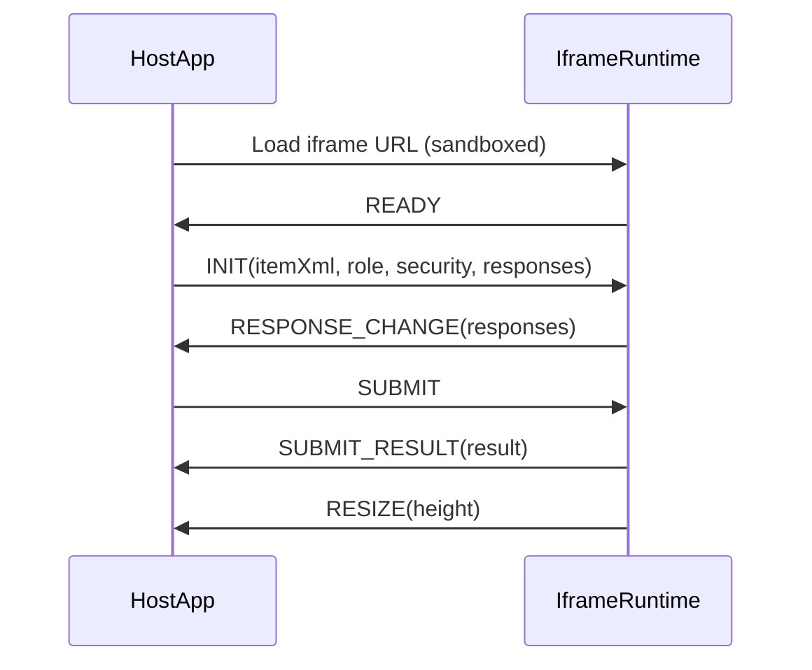

# Iframe mode (reference)

`@pie-qti/qti2-item-player` can be used in an **iframe-isolated** deployment to reduce the impact of untrusted QTI content.

This repo ships:

- **Host helper**: `@pie-qti/qti2-item-player/iframe` (browser-only)
- **Protocol types**: `QtiIframeEnvelope` + runtime validators

It does **not** ship a production-ready iframe runtime page/app. Integrators host their own runtime (the `qti2-example` app contains a **reference runtime** for demo/testing only).

## Core idea



## Security guidance

- **Best isolation**: host the iframe runtime on a **separate origin** (recommended), and set:
  - `sandbox="allow-scripts allow-same-origin"`
  - strict `postMessage` origin allowlists on **both** sides
- **Same-origin runtime**:
  - if you set `allow-same-origin` and the iframe is same-origin with the host, JS inside the iframe can access the host via `window.parent` (not an isolation boundary).
  - if you omit `allow-same-origin`, the iframe origin becomes **opaque** and `event.origin` will be `"null"`. This often breaks module-script loading unless your server allows `Origin: null`.
- **Origin allowlists**:
  - if you intentionally use an opaque-origin sandbox, you may need to allow `"null"` as an origin on the host side (not recommended for production; prefer a real, dedicated runtime origin).

## Host usage (recommended)

```ts
import { IFramePlayerHost } from '@pie-qti/qti2-item-player/iframe';

const host = new IFramePlayerHost({
  container: document.getElementById('player')!,
  iframeUrl: 'https://player-runtime.example/runtime.html',
  allowedOrigins: ['https://player-runtime.example'],
  sandbox: 'allow-scripts allow-same-origin',
  // Optional: reduce referrer leakage when the runtime loads assets
  referrerPolicy: 'no-referrer',
});

host.on((evt) => {
  if (evt.type === 'responseChange') console.log(evt.payload.responses);
  if (evt.type === 'submitResult') console.log(evt.payload.result);
});

await host.ready();
await host.init({ itemXml, role: 'candidate' });
```

## Runtime requirements (integrator-owned)

Your runtime page should:

- validate incoming `message` events:
  - `event.source === window.parent`
  - `event.origin === expectedParentOrigin` (configured; not `*`)
- respond with `READY` immediately on load
- implement handlers for `INIT`, `SET_RESPONSES`, `SUBMIT`, `RESET`
- emit `RESPONSE_CHANGE`, `SUBMIT_RESULT`, and `RESIZE`
 - use `ResizeObserver` (or similar) to keep the host container sized correctly

See the reference runtime implementation:

- `packages/qti2-example/src/routes/iframe-runtime/+page.svelte` (non-production)


